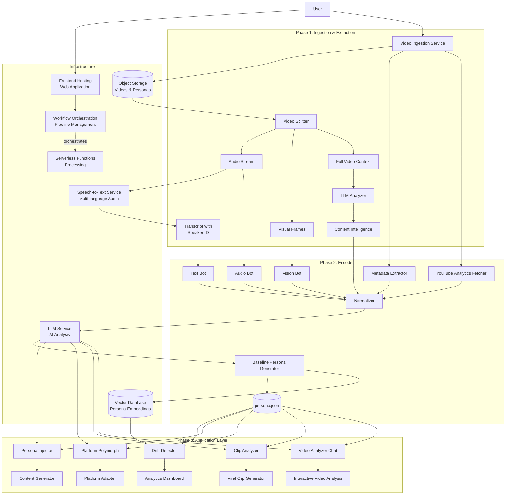
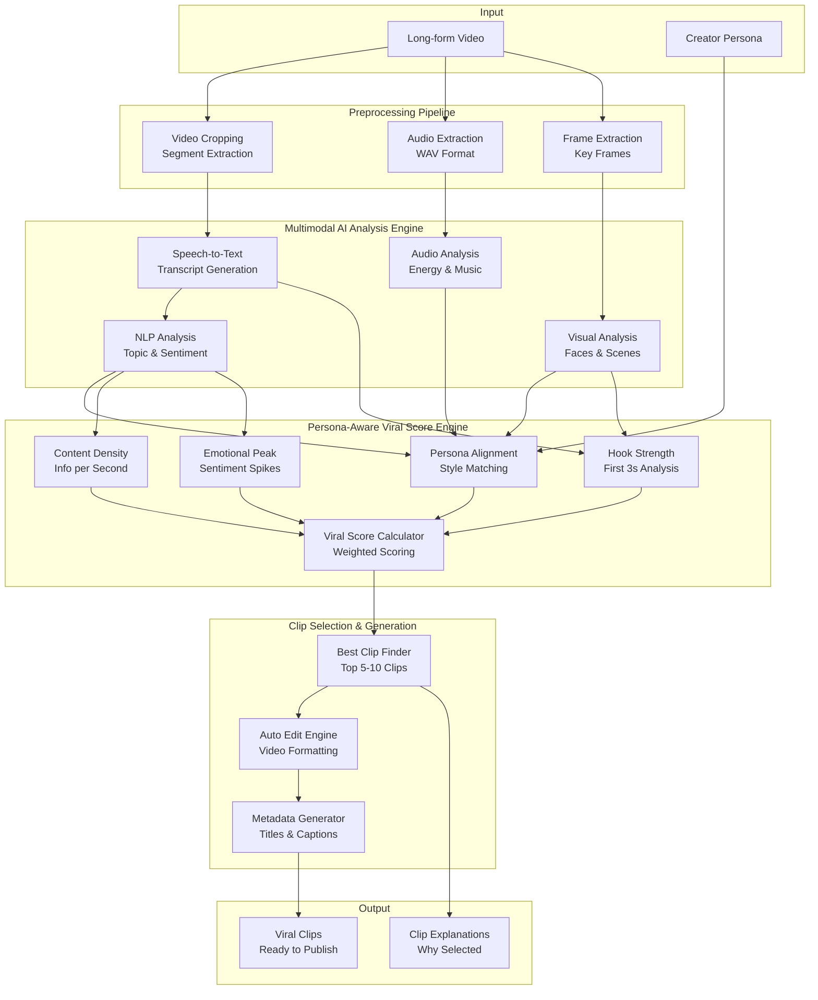
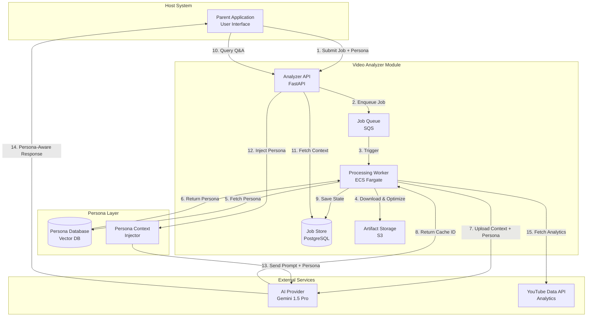
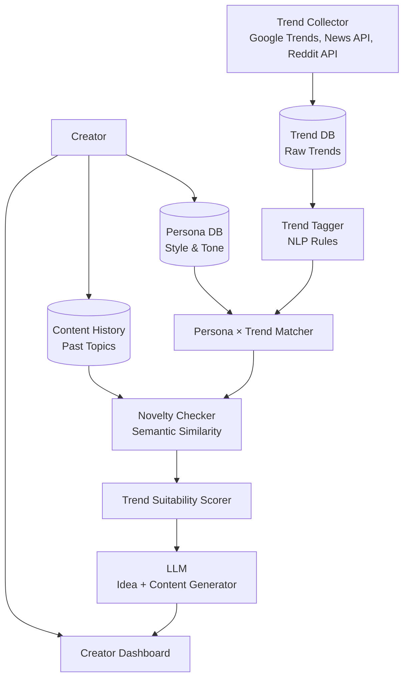
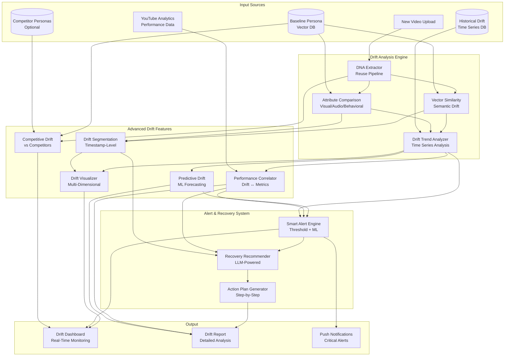

# Design Document: Project PI - Digital Persona Schema System

## Overview

Project PI is an Identity Preservation Engine that mathematically defines and preserves a content creator's unique style. The system operates as a three-phase pipeline: (1) Ingestion & Extraction, (2) Encoding, and (3) Application Layer. It analyzes video content across four DNA pillars to create a baseline persona, then provides analytics, generative, and adaptation tools to help creators maintain their authentic voice at scale.

The architecture is designed for modularity, allowing each DNA analyzer to operate independently while contributing to a unified persona schema. The system prioritizes accuracy in pattern detection and provides actionable insights rather than generic metrics.

The system is built using a serverless event-driven architecture for scalability and cost-efficiency. It leverages modern AI services for analysis, multi-language audio processing, object storage, serverless functions for orchestration, and vector databases for persona tracking and drift detection. The system integrates with YouTube Data API for comprehensive analytics and uses LLM-powered analysis for intelligent content understanding.

## Architecture

### High-Level Architecture



### Component Architecture

The system follows a serverless microservices architecture with clear separation of concerns:

1. **Ingestion Layer**: Handles external API integration, video downloading, and storage
2. **Extraction Layer**: Parallel processing of audio, visual, text, and LLM-based analysis
3. **Storage Layer**: Object storage for videos/personas, vector database for persona tracking
4. **AI Layer**: LLM services for semantic analysis, content generation, and persona injection
5. **Orchestration Layer**: Workflow orchestration for coordinating the event-driven pipeline
6. **Application Layer**: Multiple products sharing the same persona data (Clip Analyzer, Video Analyzer Chat, Drift Detector, etc.)
7. **Frontend Layer**: Web application hosting and deployment
8. **API Gateway**: RESTful API with serverless function integration for all client interactions
9. **Analytics Layer**: YouTube Data API integration for comprehensive performance metrics

### Technology Stack

**AI & Machine Learning**:
- **LLM Service**: Amazon Nova 2 Pro (via Amazon Bedrock) for semantic analysis, content generation, and persona injection (200k token context window)
- **Cost-Optimized LLM**: Amazon Nova 2 lite or similar for transcript summarization (reduces token costs)
- **RAG Implementation**: Knowledge base integration for persona-aware content generation
- **Speech-to-Text**: Amazon Transcribe for multi-language (Hindi/English) audio transcription with speaker identification
- **Multimodal AI**: Amazon Nova 2 Pro for video analysis and conversational interfaces

**Compute & Orchestration**:
- **Serverless Functions**: AWS Lambda for processing components
- **Container Runtime**: Docker containers for heavy ML libraries (OpenCV, Librosa) with 10GB storage capacity
- **Workflow Orchestration**: AWS Step Functions for pipeline coordination
- **Video Processing**: AWS Elemental MediaConvert for robust audio extraction and frame generation (avoids timeout issues)
- **Container Orchestration**: ECS Fargate for long-running processing workers

**Storage & Database**:
- **Object Storage**: Amazon S3 for videos, personas, and processing artifacts
- **Vector Database**: Amazon OpenSearch Serverless for persona embeddings and similarity search
- **Relational Database**: PostgreSQL for job state management and metadata
- **Container Registry**: Amazon ECR for Docker images
- **Message Queue**: AWS SQS for asynchronous job processing

**Computer Vision & Audio**:
- **OpenCV**: Frame analysis and shot detection (running in containers)
- **Librosa**: Acoustic analysis (running in containers)
- **FFmpeg**: Video preprocessing and optimization

**External APIs**:
- **YouTube Data API v3**: Comprehensive analytics (views, watch time, retention, engagement, demographics, traffic sources)
- **YouTube Trending API**: Trending topic discovery
- **Google Trends API**: Topic trend analysis

**Frontend & Deployment**:
- **Frontend Framework**: Modern web framework (React/Vue/Next.js)
- **API Framework**: FastAPI for high-performance REST APIs
- **Hosting**: AWS Amplify for frontend deployment
- **CDN**: Amazon CloudFront for global content delivery
- **API Gateway**: Amazon API Gateway for RESTful endpoints

**Security & Authentication**:
- **Authentication**: Amazon Cognito for user management
- **Access Control**: AWS IAM for service-level permissions

**Monitoring & Logging**:
- **Logging & Monitoring**: Amazon CloudWatch
- **Distributed Tracing**: AWS X-Ray for debugging

### Architecture Optimizations

**1. Lambda Timeout Prevention**:
- **Problem**: Processing large videos (1GB+, 15+ minutes) in Lambda hits the 15-minute timeout and memory limits with FFMPEG.
- **Solution**: Use AWS Elemental MediaConvert for video processing. MediaConvert handles extraction of audio and frame generation at scale, saving results directly to S3. This is cheaper, faster, and bulletproof compared to Lambda-based FFMPEG.
- **Benefit**: Counts as another AWS service for innovation scoring, eliminates timeout issues entirely.

**2. Heavy Dependency Management**:
- **Problem**: OpenCV and Librosa libraries often exceed the 250MB Lambda Layer limit.
- **Solution**: Deploy Vision Bot and Audio Bot as Docker Container Images stored in Amazon ECR. This provides 10GB of space instead of 250MB.
- **Benefit**: Install all heavy ML libraries without size constraints, simplifies deployment.

**3. Token Cost Optimization**:
- **Problem**: Feeding raw 1-hour transcripts with detailed prompts into Amazon Nova 2 Pro burns through tokens and costs.
- **Solution**: Implement a Summarization Chain:
  - Step 1: Use cheaper model (Claude Haiku or Amazon Titan) to clean and summarize transcript chunks
  - Step 2: Feed structured summary into Amazon Nova 2 Pro for deep psychological analysis
- **Benefit**: Significantly reduces token costs while maintaining analysis quality.

**4. Bharat-Specific Metrics**:
- **Hinglish Tokenizer**: Measures code-mixing frequency (switches_per_minute) as an indicator of informality and relatability. Enhanced with:
  - **Language Dominance Flip Detection**: Tracks when creators switch to English for technical terms and Hindi for emotional connection
  - **Desi Trust Signal**: This specific pattern (English for tech, Hindi for emotion) is a strong "Desi" trust signal
  - **Contextual Code-Mixing Analysis**: Identifies not just frequency but the purpose and context of language switches
  - **Emotional-Technical Mapping**: Correlates language choice with content type (technical explanation vs emotional storytelling)
- **Jugaad Aesthetic**: Measures background_clutter in Vision Bot. High clutter + good audio quality = authentic high-potential creator.
- **Desi-Meter Enhancement**: Combines cultural markers, local references, and Hinglish frequency for comprehensive authenticity scoring.

**5. Real-Time Progress Streaming** (Critical UX Enhancement):
- **Problem**: Asynchronous pipeline (MediaConvert + Transcribe + Analysis) can take 10-15 minutes. Users waiting without feedback creates poor UX and high abandonment rates.
- **Solution**: Implement WebSocket-based real-time progress streaming via API Gateway WebSocket API:
  - Stream partial results as they become available (don't wait for full persona)
  - Show quick metrics (WPM, cut rate, face presence) immediately after extraction
  - Display progress percentage for each pipeline stage (splitting: 20%, transcription: 40%, analysis: 70%, etc.)
  - Provide estimated time remaining based on video duration
  - Enable incremental persona updates (show Visual DNA first, then Audio DNA, then Semantic DNA)
  - Real-time status updates ("Extracting audio...", "Analyzing visual style...", "Generating insights...")
  - Frontend maintains persistent WebSocket connection to receive updates
  - Lambda functions publish progress events to API Gateway WebSocket connections
- **Benefit**: Users see immediate value, reduced perceived wait time (feels 50% faster), better engagement, lower abandonment
- **Implementation**: 
  - API Gateway WebSocket API for bidirectional communication
  - DynamoDB table to track active WebSocket connections
  - Lambda functions publish progress to connections via API Gateway Management API
  - Frontend subscribes to progress updates on job submission

### Indian Context-Specific Features

**"Desi-Meter"**: Fine-tuned prompts on Bedrock for Indian context relatability grading, measuring cultural authenticity and local connect rather than global quality metrics. Enhanced with:
- **Hinglish Tokenizer**: Detects code-mixing frequency (switches_per_minute). High switching indicates high informality/relatability in Indian content. Enhanced with:
  - **Language Dominance Flip Detection**: Tracks when creators switch to English for technical terms and Hindi for emotional connection
  - **Desi Trust Signal**: This specific pattern (English for tech, Hindi for emotion) is a strong "Desi" trust signal
  - **Contextual Code-Mixing Analysis**: Identifies not just frequency but the purpose and context of language switches
- **Cultural Markers**: Identifies local references, relatable examples, and vernacular usage patterns.
- **Authenticity Score**: Combines multiple signals to quantify "Desi" authenticity (0-1 scale).

**"Chaos Engine"**: Module to measure auditory and visual density (cuts per minute, sensory load) calibrated for Indian audience preferences where high retention correlates with high sensory load. Enhanced with:
- **Visual Density**: Measures cuts per minute, shot length, and frame complexity.
- **Auditory Density**: Measures speech rate, music presence, and silence gaps.
- **Combined Chaos Score**: Aggregates visual and auditory metrics for overall sensory load rating.

**"Jugaad Aesthetic"**: Measures background_clutter in Vision Bot to identify authentic Indian creator style:
- **Background Clutter Analysis**: In India, a "messy" background often correlates with "trustworthy/authentic" (the tech guy in his bedroom), whereas a polished studio can feel "fake."
- **Jugaad Score Calculation**: If chaos_score is high but audio_quality is good = High Potential Creator (good content, raw vibe).
- **Authenticity Indicator**: Helps identify creators with genuine, relatable content despite low production values.

**"Vernacular Translator"**: Extract persona and generate dubbed scripts in different Indian languages (Hindi, Tamil, Telugu, etc.) while preserving personality traits, jokes, and catchphrases using Bedrock's translation capabilities.

## Components and Interfaces

### 1. Video Ingestion Service

**Responsibility**: Download videos from content platforms and store them in S3 for processing.

**Interface**:
```
ingest_channel(channel_handle: string, video_count: int) -> IngestJob
  - Retrieves most recent videos from platform
  - Uploads videos to S3
  - Triggers Step Functions workflow
  - Returns job ID for tracking progress
  - Handles rate limiting and authentication

get_ingest_status(job_id: string) -> IngestStatus
  - Returns current status of ingestion job
  - Includes progress percentage and error details
```

**Key Behaviors**:
- Supports multiple platform APIs (YouTube, TikTok, etc.)
- Implements retry logic for failed downloads
- Respects platform rate limits
- Validates video accessibility before download
- Stores videos in S3 with organized bucket structure
- Emits CloudWatch metrics for monitoring

**AWS Integration**:
- Runs as Lambda function triggered by API Gateway
- Stores videos in S3 bucket with lifecycle policies
- Triggers Step Functions state machine for processing
- Uses CloudWatch for logging and monitoring

### 2. Video Splitter

**Responsibility**: Decompose video files into analyzable components using AWS Elemental MediaConvert for robust, scalable processing.

**Interface**:
```
split_video(s3_video_path: string) -> VideoComponents
  - Triggers AWS Elemental MediaConvert job for audio extraction and thumbnail generation
  - Extracts audio stream at optimal quality
  - Generates visual frames at 1fps for analysis
  - Triggers Amazon Transcribe for transcript generation
  - Returns S3 paths to all components

VideoComponents:
  - audio_s3_path: string
  - frames_s3_prefix: string
  - transcribe_job_id: string
  - mediaconvert_job_id: string
  - metadata: VideoMetadata
```

**Key Behaviors**:
- Uses AWS Elemental MediaConvert instead of FFMPEG in Lambda to avoid timeout and memory issues
- Handles large video files (1GB+, 15+ minutes) without Lambda limitations
- MediaConvert extracts audio and creates thumbnails at 1fps automatically
- Optimizes frame extraction rate based on video length
- Uses Amazon Transcribe for multi-language (Hindi/English) speech-to-text with speaker identification
- Preserves original video metadata
- Stores all artifacts in S3 with organized structure
- Cheaper and more reliable than Lambda-based FFMPEG processing

**AWS Integration**:
- Runs as Lambda function triggered by Step Functions
- Triggers AWS Elemental MediaConvert job for video processing
- MediaConvert saves audio and frames directly to S3
- Lambda monitors MediaConvert job completion via CloudWatch Events
- Starts Amazon Transcribe job after MediaConvert completes
- Supports Hindi/English multi-language transcription
- Uses CloudWatch for progress tracking and job monitoring

### 3. Vision Bot

**Responsibility**: Analyze visual frames to extract Visual DNA attributes using computer vision, deployed as Docker container for heavy ML libraries.

**Interface**:
```
analyze_visual(frames_s3_prefix: string) -> VisualDNA
  - Calculates cut_rate_per_min
  - Extracts color_palette
  - Classifies camera_angles
  - Measures face_presence
  - Calculates avg_shot_length_sec
  - Measures visual_density for "Chaos Engine"
  - Measures background_clutter for "Jugaad Aesthetic"

VisualDNA:
  - cut_rate_per_min: float
  - color_palette: ColorPalette
  - camera_angles: AngleDistribution
  - face_presence: float (0-1)
  - avg_shot_length_sec: float
  - visual_density: float (sensory load metric)
  - background_clutter: float (0-1, authenticity indicator)
  - jugaad_score: float (high clutter + good quality = authentic)
```

**Key Behaviors**:
- Detects shot boundaries using frame difference algorithms
- Uses color quantization for palette extraction
- Employs face detection models for presence calculation
- Classifies angles using pose estimation or heuristics
- Calculates visual density for Indian audience preferences
- Measures background_clutter: In India, a "messy" background often correlates with "trustworthy/authentic" (tech guy in bedroom), whereas polished studio can feel "fake"
- Calculates jugaad_score: If chaos_score is high but audio_quality is good = High Potential Creator (good content, raw vibe)

**AWS Integration**:
- Deployed as Docker Container Image in Lambda (stored in Amazon ECR) to handle heavy OpenCV libraries
- Docker deployment provides 10GB space vs 250MB Lambda Layer limit
- Reads frames from S3
- Optionally uses Amazon Rekognition for enhanced face detection
- Stores results in S3 and passes to normalizer

### 4. Audio Bot

**Responsibility**: Analyze audio streams to extract Audio DNA attributes using acoustic analysis, deployed as Docker container for heavy ML libraries.

**Interface**:
```
analyze_audio(audio_s3_path: string, transcript_s3_path: string) -> AudioDNA
  - Calculates avg_wpm
  - Measures pitch_variance
  - Classifies music_genre
  - Measures silence_gaps
  - Calculates auditory_density for "Chaos Engine"
  - Measures audio_quality for "Jugaad Aesthetic"

AudioDNA:
  - avg_wpm: float
  - pitch_variance: float
  - music_genre: string[]
  - silence_gaps: SilencePattern
  - auditory_density: float (sensory load metric)
  - audio_quality: float (0-1, production quality indicator)
```

**Key Behaviors**:
- Aligns Amazon Transcribe transcript with audio for WPM calculation
- Uses pitch tracking algorithms for variance measurement
- Employs music classification models for genre detection
- Identifies silence periods using amplitude thresholds
- Calculates auditory density for Indian audience preferences
- Measures audio_quality: Used in jugaad_score calculation (high visual chaos + good audio = authentic creator)

**AWS Integration**:
- Deployed as Docker Container Image in Lambda (stored in Amazon ECR) to handle heavy Librosa libraries
- Docker deployment provides 10GB space vs 250MB Lambda Layer limit
- Reads audio and transcript from S3
- Uses Amazon Transcribe output with speaker identification
- Stores results in S3 and passes to normalizer

### 5. Text Bot

**Responsibility**: Analyze transcripts to extract Semantic DNA attributes using Amazon Bedrock with optimized token usage via summarization chain.

**Interface**:
```
analyze_semantic(transcript_s3_path: string) -> SemanticDNA
  - Identifies catchphrases
  - Classifies hook_style
  - Extracts topic_clusters
  - Measures sentiment
  - Identifies narrative_structure
  - Calculates desi_meter (Indian context relatability)
  - Measures hinglish_tokenizer (code-mixing frequency)

SemanticDNA:
  - catchphrases: Phrase[]
  - hook_style: HookStyle
  - topic_clusters: TopicCluster[]
  - sentiment: Sentiment
  - narrative_structure: NarrativePattern
  - desi_meter: DesiMeter
  - hinglish_metrics: HinglishMetrics

DesiMeter:
  - score: float (0-1, cultural authenticity score)
  - cultural_markers: string[]
  - hinglish_frequency: float (code-mixing indicator)
  - local_references: int
  - relatable_examples: int

HinglishMetrics:
  - switches_per_minute: float (language switching frequency)
  - hindi_percentage: float (0-1)
  - english_percentage: float (0-1)
  - informality_score: float (high switching = high informality/relatability)
```

**Key Behaviors**:
- Uses n-gram frequency analysis for catchphrase detection
- Implements Summarization Chain to reduce token costs:
  - Step 1: Uses cheaper model (Claude Haiku or Titan) to clean and summarize transcript chunks
  - Step 2: Feeds structured summary into Amazon Nova 2 Pro for deep psychological analysis
- Employs Amazon Bedrock (Amazon Nova 2 Pro) for hook style classification
- Uses topic modeling with Bedrock for clustering
- Applies sentiment analysis using Bedrock
- Pattern matches common narrative structures
- Calculates "Desi-Meter" for Indian context relatability
- Detects "Hinglish Tokenizer": Measures code-mixing frequency (switches_per_minute)
- High switching indicates high informality/relatability in Indian content

**AWS Integration**:
- Runs as Lambda function
- Reads transcript from S3
- Calls Amazon Bedrock API with two-stage approach:
  - Claude Haiku/Titan for summarization (cost optimization)
  - Amazon Nova 2 Pro for deep analysis
- Uses fine-tuned prompts for Indian context analysis
- Stores results in S3 and passes to normalizer

### 6. Metadata Extractor

**Responsibility**: Extract behavioral attributes from video metadata.

**Interface**:
```
extract_behavioral(video_metadata: VideoMetadata[]) -> BehavioralDNA
  - Calculates call_to_action_freq
  - Identifies upload_schedule
  - Classifies community_tone

BehavioralDNA:
  - call_to_action_freq: float
  - upload_schedule: SchedulePattern
  - community_tone: ToneClassification
```

**Key Behaviors**:
- Analyzes video descriptions and end screens for CTAs
- Identifies temporal patterns in upload times
- Classifies tone from comments and community posts

### 7. Normalizer

**Responsibility**: Aggregate and normalize extracted DNA data, then store in OpenSearch.

**Interface**:
```
normalize(
  visual_dna: VisualDNA[],
  audio_dna: AudioDNA[],
  semantic_dna: SemanticDNA[],
  behavioral_dna: BehavioralDNA
) -> NormalizedPersona
  - Calculates statistical aggregates (mean, std dev)
  - Identifies top-performing video patterns
  - Normalizes scales across attributes
  - Generates persona embeddings for OpenSearch
```

**Key Behaviors**:
- Computes weighted averages based on video performance
- Handles missing data gracefully
- Normalizes numeric values to comparable scales
- Identifies outliers and filters them appropriately
- Generates vector embeddings for persona storage

**AWS Integration**:
- Runs as Lambda function
- Reads DNA data from S3
- Generates embeddings using Amazon Bedrock
- Stores normalized data in S3
- Indexes persona vectors in Amazon OpenSearch Serverless

### 8. Baseline Persona Generator

**Responsibility**: Create the canonical persona.json file and store in S3 and OpenSearch.

**Interface**:
```
generate_baseline(normalized: NormalizedPersona) -> PersonaSchema
  - Constructs persona.json structure
  - Validates against schema
  - Versions the persona
  - Stores in S3 and OpenSearch

PersonaSchema:
  - version: string
  - created_at: timestamp
  - author_persona: AuthorPersona
  - visual_dna: VisualDNA
  - audio_dna: AudioDNA
  - semantic_dna: SemanticDNA
  - behavioral_dna: BehavioralDNA
  - indian_context_metrics: IndianContextMetrics
```

**Key Behaviors**:
- Follows strict JSON schema validation
- Includes metadata for versioning and tracking
- Stores both aggregate and per-video data
- Generates human-readable summary
- Creates vector embeddings for similarity search

**AWS Integration**:
- Runs as Lambda function
- Stores persona.json in S3 with versioning enabled
- Indexes persona vectors in Amazon OpenSearch Serverless
- Uses S3 lifecycle policies for version management
- Emits CloudWatch metrics for monitoring

### 9. Drift Detector

**Responsibility**: Compare new content against baseline persona using OpenSearch vector similarity.

**Interface**:
```
detect_drift(
  new_video_s3_path: string,
  baseline_persona: PersonaSchema
) -> DriftReport
  - Analyzes new video
  - Compares against baseline using vector similarity
  - Calculates drift scores
  - Generates alerts
  - Queries OpenSearch for historical drift patterns

DriftReport:
  - overall_drift_score: float
  - visual_drift: DriftDetail
  - audio_drift: DriftDetail
  - semantic_drift: DriftDetail
  - behavioral_drift: DriftDetail
  - alerts: Alert[]
  - recommendations: string[]
  - historical_trend: DriftTrend[]
```

**Key Behaviors**:
- Reuses extraction pipeline for new video analysis
- Calculates per-attribute drift using distance metrics
- Uses OpenSearch vector similarity for semantic drift
- Applies thresholds for alert generation
- Correlates drift with performance when available
- Tracks drift trends over time using OpenSearch

**AWS Integration**:
- Runs as Lambda function
- Reads baseline persona from S3 and OpenSearch
- Triggers Step Functions for new video analysis
- Queries OpenSearch for historical drift patterns
- Stores drift reports in S3
- Emits CloudWatch alarms for high drift

### 10. Persona Injector

**Responsibility**: Rewrite content using creator's semantic DNA via Amazon Bedrock with RAG.

**Interface**:
```
inject_persona(
  generic_content: string,
  persona: PersonaSchema,
  content_type: ContentType
) -> GeneratedContent
  - Rewrites content using persona patterns
  - Uses RAG to recall specific past examples
  - Maintains semantic DNA attributes
  - Preserves core message

GeneratedContent:
  - rewritten_text: string
  - alignment_score: float
  - applied_patterns: string[]
  - recalled_examples: string[]
```

**Key Behaviors**:
- Constructs Bedrock prompts with persona attributes
- Uses Knowledge Bases for Amazon Bedrock for RAG
- Recalls specific past jokes, hooks, and catchphrases
- Validates output against semantic DNA
- Iteratively refines if alignment is low
- Preserves factual content while adjusting style

**AWS Integration**:
- Runs as Lambda function
- Calls Amazon Bedrock API with Amazon Nova 2 Pro
- Uses Knowledge Bases for Amazon Bedrock for RAG
- Queries OpenSearch for similar past content
- Stores generated content in S3
- Tracks generation quality metrics in CloudWatch

### 11. Platform Polymorph

**Responsibility**: Adapt content for different platforms while preserving identity using Bedrock.

**Interface**:
```
adapt_for_platform(
  source_content: VideoContent,
  persona: PersonaSchema,
  target_platform: Platform
) -> AdaptedContent
  - Applies platform-specific constraints
  - Preserves core identity attributes
  - Optimizes for platform algorithms
  - Generates vernacular translations if needed

AdaptedContent:
  - adapted_video: VideoContent
  - adaptation_report: AdaptationReport
  - preserved_attributes: string[]
  - vernacular_scripts: VernacularScript[] (optional)
```

**Key Behaviors**:
- Applies platform-specific rules (duration, aspect ratio, pacing)
- Maintains visual and audio DNA within constraints
- Adjusts behavioral DNA for platform norms
- Validates that core identity is preserved
- Generates vernacular translations using Bedrock

**AWS Integration**:
- Runs as Lambda function
- Calls Amazon Bedrock for content adaptation
- Uses Bedrock for vernacular translation (Hindi, Tamil, Telugu, etc.)
- Stores adapted content in S3
- Validates adaptation quality using drift detection

### 12. YouTube Analytics Fetcher

**Responsibility**: Retrieve comprehensive performance analytics from YouTube Data API for video analysis and correlation.

**Interface**:
```
fetch_video_analytics(video_id: string, timeframe: TimeRange) -> VideoAnalytics
  - Retrieves views over time
  - Fetches watch time and retention graphs
  - Gets engagement metrics (likes, comments, shares, CTR)
  - Retrieves audience demographics
  - Fetches traffic sources
  - Returns all available YouTube analytics

fetch_channel_analytics(channel_id: string) -> ChannelAnalytics
  - Retrieves channel-level metrics
  - Gets subscriber growth over time
  - Fetches top-performing videos
  - Returns channel demographics

VideoAnalytics:
  - video_id: string
  - views_over_time: TimeSeriesData[]
  - total_views: int
  - watch_time_hours: float
  - average_view_duration: float
  - retention_graph: RetentionData[]
  - likes: int
  - comments: int
  - shares: int
  - ctr: float (click-through rate)
  - demographics: DemographicData
  - traffic_sources: TrafficSource[]
  - top_moments: Moment[] (high retention points)
```

**Key Behaviors**:
- Uses YouTube Data API v3 for comprehensive analytics
- Handles API rate limiting and quota management
- Caches analytics data to minimize API calls
- Identifies high-retention moments for clip suggestions
- Correlates performance metrics with persona attributes
- Supports historical data retrieval for trend analysis

**Integration**:
- Runs as serverless function
- Stores analytics data in database for correlation analysis
- Feeds data to Drift Detector for performance correlation
- Provides data to Clip Analyzer for viral moment identification
- Used by Video Analyzer Chat for performance insights

### 13. LLM Analyzer

**Responsibility**: Perform intelligent, context-aware analysis of entire video content using large language models to extract high-level insights.

**Interface**:
```
analyze_video_content(video_path: string, transcript: string, frames: Frame[]) -> ContentIntelligence
  - Analyzes entire video holistically
  - Generates comprehensive content summary
  - Identifies key moments and highlights
  - Maps emotional arc throughout video
  - Extracts main topics and themes
  - Predicts engagement potential
  - Identifies viral moments
  - Detects content structure and pacing
  - Analyzes storytelling effectiveness

ContentIntelligence:
  - overall_summary: string (2-3 sentence summary)
  - detailed_summary: string (paragraph-level summary)
  - key_moments: KeyMoment[] (timestamp + description + importance score)
  - emotional_arc: EmotionalArc (valence over time)
  - main_topics: Topic[] (extracted themes with confidence scores)
  - engagement_prediction: float (0-1, predicted engagement score)
  - viral_moments: ViralMoment[] (high-potential clips with reasoning)
  - content_structure: Structure (intro/body/conclusion breakdown)
  - pacing_analysis: PacingAnalysis (slow/fast segments)
  - storytelling_score: float (0-1, narrative effectiveness)
  - hook_effectiveness: float (0-1, first 30 seconds analysis)
  - retention_predictions: RetentionPrediction[] (predicted drop-off points)
  - content_gaps: Gap[] (missing elements or improvement areas)
  - audience_fit: AudienceFit (target audience alignment)
```

**Key Behaviors**:
- Uses multimodal LLM (Gemini 1.5 Pro or Amazon Nova 2 Pro) for holistic analysis
- Processes entire video context (up to 1 hour) in single pass
- Combines visual, audio, and textual signals for comprehensive understanding
- Identifies patterns that individual analyzers might miss
- Provides human-readable explanations for all insights
- Generates actionable recommendations for improvement
- Predicts audience response based on content patterns
- Identifies viral potential moments with reasoning

**Integration**:
- Runs as serverless function in Ingestion & Extraction phase
- Receives full video, transcript, and frame samples
- Outputs feed into Normalizer alongside other DNA data
- Insights used by Clip Analyzer for intelligent clip selection
- Powers Video Analyzer Chat with deep content understanding
- Enhances Drift Detector with semantic content analysis

### 14. Clip Analyzer (Viral Clip Generation System)

**Responsibility**: Automatically identify and generate viral-potential clips from long-form videos using multimodal AI analysis and persona-aware scoring.

**Architecture**:



**Interface**:
```
generate_clips(
  video_path: string,
  persona: PersonaSchema,
  clip_count: int = 10,
  min_duration: int = 30,
  max_duration: int = 90
) -> ClipSuggestions
  - Analyzes long-form video for clip potential
  - Scores segments using persona-aware viral scoring
  - Ranks clips by viral potential
  - Generates preview thumbnails
  - Provides explanations for each suggestion
  - Optionally auto-edits and formats clips

ClipSuggestions:
  - clips: ClipSuggestion[]
  - analysis_summary: string
  - overall_clip_potential: float (0-1)

ClipSuggestion:
  - clip_id: string
  - start_timestamp: float
  - end_timestamp: float
  - duration_sec: float
  - viral_potential_score: float (0-1)
  - persona_alignment_score: float (0-1)
  - content_density_score: float (0-1)
  - hook_strength_score: float (0-1)
  - emotional_peak_score: float (0-1)
  - explanation: string (why this clip was selected)
  - thumbnail_path: string
  - suggested_title: string
  - suggested_caption: string
  - suggested_hashtags: string[]
  - target_platforms: Platform[] (best platforms for this clip)
```

**Key Behaviors**:
- **Preprocessing**: Segments video into analyzable chunks, extracts audio and key frames
- **Multimodal Analysis**: Combines speech-to-text, NLP, audio analysis, and visual analysis
- **Persona Alignment**: Compares clip characteristics against creator's baseline persona
  - Matches pacing, energy, hook style, visual style
  - Identifies clips that feel "on-brand"
  - Penalizes clips that drift from successful patterns
- **Content Density**: Measures information per second (high density = more engaging)
- **Hook Strength**: Analyzes first 3 seconds for attention-grabbing potential
- **Emotional Peaks**: Identifies sentiment spikes (excitement, surprise, humor)
- **Viral Scoring**: Weighted combination of all factors
  - Persona alignment: 30%
  - Content density: 25%
  - Hook strength: 25%
  - Emotional peak: 20%
- **Clip Selection**: Ranks all segments, returns top N non-overlapping clips
- **Auto-Editing**: Formats clips for target platforms (aspect ratio, duration, captions)
- **Metadata Generation**: Creates titles, captions, hashtags using LLM

**Integration**:
- Runs as containerized worker (ECS Fargate) for long-running processing
- Uses job queue (SQS) for asynchronous processing
- Stores clips and metadata in object storage
- Leverages persona data from baseline generator
- Uses LLM Analyzer insights for intelligent selection
- Integrates with YouTube Analytics for historical performance data

### 15. Video Analyzer Chat

**Responsibility**: Provide conversational, interactive video analysis through a chat interface with persona-aware insights and timestamp-level recommendations.

**Architecture**:



**Interface**:
```
submit_video_analysis(
  video_url: string,
  persona_id: string,
  analysis_type: AnalysisType
) -> AnalysisJob
  - Accepts video URL or file upload
  - Queues video for processing
  - Returns job ID for tracking
  - Optimizes video using FFmpeg
  - Uploads context to LLM with long context window

query_video(
  job_id: string,
  question: string,
  persona_id: string
) -> AnalysisResponse
  - Accepts natural language questions
  - Retrieves video context and persona
  - Injects persona into LLM prompt
  - Returns persona-aware insights
  - Provides timestamp-level recommendations

AnalysisResponse:
  - answer: string (conversational response)
  - timestamp_recommendations: TimestampRecommendation[]
  - video_level_insights: Insight[]
  - persona_comparison: PersonaComparison
  - improvement_suggestions: Suggestion[]
  - confidence_score: float (0-1)
```

**Key Behaviors**:
- **Video Processing**: Downloads and optimizes video using FFmpeg for efficient LLM processing
- **Context Upload**: Uploads entire video context to LLM (Gemini 1.5 Pro with long context window)
- **Persona Injection**: Retrieves creator's baseline persona and injects into every query
  - Compares video against creator's successful patterns
  - Provides persona-aware recommendations
  - Identifies drift from baseline style
- **Conversational Interface**: Natural language Q&A about video content
  - "What's working well in this video?"
  - "Where did I lose energy?"
  - "How does this compare to my best videos?"
  - "What should I change at timestamp 2:35?"
- **Timestamp-Level Analysis**: Pinpoints specific moments needing improvement
- **Performance Integration**: Fetches YouTube analytics for data-backed insights
- **Job State Management**: Tracks processing status in PostgreSQL
- **Caching**: Stores LLM context cache ID for fast subsequent queries

**Integration**:
- Runs as FastAPI service with ECS Fargate workers
- Uses SQS for asynchronous job processing
- Stores artifacts in S3
- Leverages persona data from vector database
- Integrates with YouTube Analytics Fetcher
- Uses LLM Analyzer insights for deep understanding

### 16. Trend Analyzer (Persona-Driven Trend Selection with Novelty Guarantee)

**Responsibility**: Discover trending topics from multiple sources and match them with creator's persona while guaranteeing novelty to prevent repetitive content.

**Architecture**:



**Interface**:
```
fetch_trending_topics(
  creator_id: string,
  exploration_factor: float = 0.5,
  count: int = 20,
  timeframe: TimeFrame = "24h"
) -> TrendRecommendations
  - Fetches trending topics from multiple sources
  - Tags trends with categories and keywords
  - Matches trends against creator's persona
  - Checks novelty against creator's content history
  - Scores trends by suitability
  - Generates content ideas using LLM
  - Returns ranked recommendations

TrendRecommendations:
  - trends: TrendRecommendation[]
  - exploration_factor: float (0-1, exploitation vs exploration)
  - novelty_guarantee: NoveltyGuarantee
  - refresh_timestamp: timestamp

TrendRecommendation:
  - trend_id: string
  - trend_name: string
  - trend_description: string
  - source: string (google_trends, news_api, reddit, youtube_trending)
  - trending_score: float (0-1, how hot is this trend)
  - persona_fit_score: float (0-1, how well it matches creator's style)
  - novelty_score: float (0-1, how different from past content)
  - suitability_score: float (0-1, weighted combination)
  - explanation: string (why this trend was recommended)
  - content_ideas: ContentIdea[] (LLM-generated video ideas)
  - related_keywords: string[]
  - estimated_search_volume: int
  - trend_velocity: string (rising_fast, steady, declining)
  - competition_level: string (low, medium, high)
```

**Key Behaviors**:

**1. Trend Collection**:
- **Google Trends API**: Fetches trending search queries by region and category
- **News API**: Retrieves trending news topics and headlines
- **Reddit API**: Scrapes trending posts from relevant subreddits
- **YouTube Trending API**: Gets trending videos in creator's niche
- **Refresh Frequency**: Updates every 6 hours, stores in Trend DB

**2. Trend Tagging (NLP Rules)**:
- Extracts keywords and entities from trend descriptions
- Categorizes trends (tech, lifestyle, entertainment, education, etc.)
- Identifies trend type (event, product, concept, person, challenge)
- Measures trend sentiment (positive, negative, neutral)
- Detects trend lifecycle stage (emerging, peak, declining)

**3. Persona × Trend Matching**:
- Retrieves creator's persona from Persona DB
- Compares trend characteristics against persona DNA:
  - **Semantic DNA**: Does topic align with creator's usual topics?
  - **Tone Match**: Does trend sentiment match creator's tone?
  - **Complexity Match**: Does trend complexity match creator's content depth?
  - **Audience Match**: Does trend appeal to creator's demographics?
- Calculates persona fit score (0-1)

**4. Novelty Checker (Semantic Similarity)**:
- Retrieves creator's content history (past video topics and embeddings)
- Generates embedding for each trend using LLM
- Calculates semantic similarity between trend and past content
- **Strategic Repetition Logic**: Instead of blanket rejection, allows high similarity (>70%) if the previous video on that topic was an "Outlier Success" (high viral score)
  - Filters out trends with >70% similarity to past content UNLESS the similar past video was highly successful
  - Identifies "Outlier Success" videos: viral_score > 0.8 or performance in top 10% of creator's content
  - Enables "Strategic Repetition": doing the same successful topic again with a slight twist
  - YouTube algorithms often reward iteration on successful topics
- Ensures creator doesn't repeat unsuccessful topics
- Novelty score calculation:
  - If similarity >70% AND past video was Outlier Success: novelty_score = 0.5 (moderate novelty, strategic repetition)
  - If similarity >70% AND past video was NOT Outlier Success: novelty_score = 0.0 (filtered out)
  - If similarity ≤70%: novelty_score = 1 - max_similarity_to_past_content

**5. Trend Suitability Scorer**:
- Weighted scoring based on exploration factor:
  - **Exploitation Mode (exploration_factor = 0.0)**:
    - Persona fit: 70%
    - Trending score: 20%
    - Novelty: 10%
  - **Balanced Mode (exploration_factor = 0.5)**:
    - Persona fit: 40%
    - Trending score: 30%
    - Novelty: 30%
  - **Exploration Mode (exploration_factor = 1.0)**:
    - Persona fit: 20%
    - Trending score: 30%
    - Novelty: 50%
- Ranks trends by suitability score

**6. LLM Content Idea Generator**:
- For each recommended trend, generates 3-5 video ideas
- Ideas are persona-aware (match creator's style and tone)
- Includes suggested titles, hooks, and content structure
- Provides reasoning for why each idea would work

**7. Exploration/Exploitation Slider**:
- **Exploitation (0.0)**: Safe, proven topics that match creator's brand
- **Balanced (0.5)**: Mix of familiar and new topics
- **Exploration (1.0)**: Novel, trending topics outside creator's comfort zone

**Integration**:
- Runs as scheduled job (every 6 hours) and on-demand
- Stores trends in relational database with embeddings in vector DB
- Uses LLM for semantic matching and content idea generation
- Integrates with Persona DB and Content History DB
- Provides REST API for creator dashboard

### 17. Content Drifter (Advanced Multi-Dimensional Drift Detection & Recovery System)

**Responsibility**: Continuously monitor creator's content for style drift, predict future drift, correlate with performance, provide recovery recommendations, and enable competitive analysis.

**Architecture**:



**Interface**:
```
analyze_drift(
  video_id: string,
  creator_id: string,
  enable_prediction: bool = true,
  enable_competitive_analysis: bool = false,
  competitor_ids: string[] = []
) -> ComprehensiveDriftReport
  - Extracts DNA from new video
  - Compares against baseline persona (vector + attribute-level)
  - Analyzes drift trends over time
  - Predicts future drift trajectory
  - Correlates drift with performance metrics
  - Segments drift by timestamp
  - Generates multi-dimensional visualization
  - Compares against competitors (optional)
  - Generates smart alerts
  - Creates recovery recommendations
  - Produces action plan

ComprehensiveDriftReport:
  - video_id: string
  - analyzed_at: timestamp
  - overall_drift_score: float (0-1)
  - drift_severity: string (none, low, medium, high, critical)
  - drift_breakdown: DriftBreakdown
  - drift_trends: DriftTrends
  - predictive_drift: PredictiveDrift
  - performance_correlation: PerformanceCorrelation
  - timestamp_drift: TimestampDrift[]
  - visualization_data: VisualizationData
  - competitive_analysis: CompetitiveDrift (optional)
  - alerts: SmartAlert[]
  - recovery_plan: RecoveryPlan
  - action_items: ActionItem[]
```

**Key Behaviors**:

**1. Multi-Dimensional Drift Detection**:

**Visual Drift**:
- Cut rate deviation (faster/slower editing)
- Color palette shift (different color schemes)
- Camera angle changes (more/less close-ups)
- Face presence deviation (more/less on-camera time)
- Shot length changes (longer/shorter shots)
- Visual density shift (more/less chaotic editing)
- Background clutter changes (more/less polished)

**Audio Drift**:
- Speaking pace deviation (faster/slower WPM)
- Pitch variance changes (more/less vocal variety)
- Music genre shift (different music styles)
- Silence gap changes (more/less pauses)
- Auditory density shift (more/less sensory load)
- Audio quality changes (better/worse production)

**Semantic Drift**:
- Catchphrase usage deviation (using/not using signature phrases)
- Hook style changes (different opening styles)
- Topic cluster shift (covering different topics)
- Sentiment changes (more/less positive/energetic)
- Narrative structure changes (different storytelling patterns)
- Desi-meter changes (more/less cultural authenticity)
- Hinglish usage changes (more/less code-mixing)

**Behavioral Drift**:
- CTA frequency changes (more/less calls-to-action)
- Upload schedule deviation (irregular posting)
- Community tone changes (different engagement style)

**2. Vector-Based Semantic Drift**:
- Generates embedding for new video using LLM
- Compares against baseline persona embedding in vector DB
- Calculates cosine similarity (1 - similarity = drift)
- Identifies semantic drift that attribute-level analysis might miss

**3. Drift Trend Analysis (Time Series)**:
- Tracks drift scores over last 20 videos
- Calculates rolling averages (7-day, 30-day)
- Identifies drift patterns:
  - **Gradual Drift**: Slow, consistent deviation over time
  - **Sudden Drift**: Abrupt change in single video
  - **Oscillating Drift**: Back-and-forth between styles
  - **Accelerating Drift**: Drift rate increasing over time
- Detects drift direction (drifting towards what?)

**4. Predictive Drift (ML Forecasting)**:
- Uses time series forecasting (ARIMA, Prophet, or LSTM)
- Predicts drift score for next 5 videos
- Confidence intervals for predictions
- Early warning system: "If current trend continues, you'll hit high drift in 3 videos"
- Identifies attributes most likely to drift next

**5. Performance Correlation**:
- Fetches YouTube Analytics for recent videos
- Correlates drift scores with performance metrics:
  - Views: Does drift correlate with view changes?
  - Retention: Does drift affect watch time?
  - Engagement: Does drift impact likes/comments?
  - CTR: Does drift affect click-through rate?
- Calculates Pearson correlation coefficients
- Identifies **harmful drift** (negative correlation) vs **beneficial drift** (positive correlation)
- Highlights specific attributes causing performance changes

**6. Timestamp-Level Drift Segmentation**:
- Analyzes drift at 30-second intervals within video
- Identifies specific moments where drift occurs
- Example: "At 2:35, your pacing slowed by 30% (152 WPM vs baseline 165 WPM)"
- Pinpoints exact timestamps for creator to review

**7. Multi-Dimensional Drift Visualization**:
- **Radar Chart**: Shows drift across all 4 DNA pillars
- **Time Series Chart**: Drift score over last 20 videos
- **Heatmap**: Attribute-level drift intensity
- **Scatter Plot**: Drift vs performance correlation
- **Trajectory Plot**: Predicted future drift path

**8. Competitive Drift Analysis** (Optional):
- Compares creator's drift against competitors
- Identifies if creator is drifting towards or away from competitors
- Highlights differentiation opportunities
- Shows competitive positioning in style space

**9. Smart Alert Engine**:
- **Threshold-Based Alerts**: Trigger when drift exceeds configurable thresholds
- **ML-Based Alerts**: Trigger when drift pattern is anomalous
- **Performance-Linked Alerts**: Trigger when drift correlates with performance drop
- **Predictive Alerts**: Trigger when forecasted drift will be problematic
- Alert severity levels: Info, Warning, Critical
- Customizable alert preferences per creator

**10. Recovery Recommendation System** (LLM-Powered):
- Analyzes drift report and generates personalized recommendations
- Identifies root causes of drift
- Suggests specific adjustments:
  - "Increase your cut rate from 9.2 to 12.5 cuts/min"
  - "Return to using your signature catchphrase 'let's dive in' in the intro"
  - "Restore your typical high-energy pacing (165 WPM)"
- Prioritizes recommendations by impact
- Provides reasoning for each recommendation

**11. Action Plan Generator**:
- Creates step-by-step action plan for drift recovery
- Includes specific, measurable, achievable goals
- Timeline for recovery (e.g., "Implement over next 3 videos")
- Success metrics to track
- Example action items:
  - "Video 1: Focus on restoring pacing and energy"
  - "Video 2: Reintroduce signature catchphrases"
  - "Video 3: Return to baseline visual style"

**12. Historical Drift Patterns**:
- Stores all drift reports in time series database
- Enables historical analysis:
  - "You had similar drift in Q2 2024, and recovered by..."
  - "Your drift patterns are seasonal (higher drift in summer)"
- Learns from past drift recovery successes

**13. Drift Notifications**:
- Push notifications for critical drift alerts
- Email summaries of drift trends (weekly/monthly)
- Slack/Discord integration for team notifications
- Customizable notification preferences

**Integration**:
- Runs as serverless function triggered by new video upload
- Stores drift reports in time series database (InfluxDB or TimescaleDB)
- Uses vector database for semantic drift comparison
- Integrates with YouTube Analytics Fetcher for performance data
- Uses LLM for recovery recommendations and explanations
- Provides real-time dashboard via WebSocket connections
- REST API for historical drift queries

---

## Application Layer: Advanced Drift & Trend Integration

### Drift Detector + Trend Analyzer Synergy

The Drift Detector and Trend Analyzer work together to provide holistic content guidance:

1. **Drift-Aware Trend Recommendations**: Trend Analyzer considers current drift when recommending topics
   - If creator is drifting high, recommend trends that align with baseline persona (recovery mode)
   - If creator is stable, allow more exploration

2. **Trend-Induced Drift Monitoring**: Drift Detector tracks if following trend recommendations causes drift
   - Measures drift before and after trend-based videos
   - Learns which trends are safe vs risky for creator's brand

3. **Competitive Positioning**: Combined analysis shows how creator's drift compares to competitors' trend adoption
   - Identifies differentiation opportunities
   - Highlights when competitors are drifting towards creator's style

4. **Performance-Trend Correlation**: Links trend adoption with performance and drift
   - "Trending topics increased views by 25% but caused 15% drift"
   - Helps creator make informed trade-offs

---

**AWS Integration**:

## Data Models

### PersonaSchema (persona.json)

```json
{
  "version": "1.0.0",
  "created_at": "2024-01-15T10:30:00Z",
  "updated_at": "2024-01-15T10:30:00Z",
  "channel_handle": "creator_name",
  "videos_analyzed": 50,
  "s3_bucket": "project-PI-personas",
  "opensearch_index": "persona-vectors",
  
  "author_persona": {
    "demographics": {
      "primary_language": "en",
      "secondary_languages": ["hi", "ta"],
      "content_category": "tech_education"
    },
    "personality_traits": {
      "energy_level": 0.85,
      "formality": 0.3,
      "humor_frequency": 0.6
    }
  },
  
  "visual_dna": {
    "cut_rate_per_min": {
      "mean": 12.5,
      "std_dev": 2.3,
      "top_10_mean": 14.2
    },
    "color_palette": {
      "dominant_colors": ["#FF5733", "#3498DB", "#2ECC71"],
      "saturation_level": 0.75,
      "brightness_level": 0.65
    },
    "camera_angles": {
      "close_up": 0.45,
      "medium": 0.35,
      "wide": 0.20
    },
    "face_presence": {
      "mean": 0.78,
      "std_dev": 0.12
    },
    "avg_shot_length_sec": {
      "mean": 4.8,
      "std_dev": 1.2
    },
    "visual_density": {
      "mean": 0.82,
      "std_dev": 0.15,
      "comment": "High sensory load for Indian audience"
    },
    "background_clutter": {
      "mean": 0.65,
      "std_dev": 0.18,
      "comment": "Messy background = trustworthy/authentic in Indian context"
    },
    "jugaad_score": {
      "mean": 0.72,
      "std_dev": 0.14,
      "comment": "High chaos + good audio quality = High Potential Creator"
    }
  },
  
  "audio_dna": {
    "avg_wpm": {
      "mean": 165.0,
      "std_dev": 15.0
    },
    "pitch_variance": {
      "mean": 0.42,
      "std_dev": 0.08
    },
    "music_genre": ["electronic", "lo-fi", "bollywood"],
    "silence_gaps": {
      "avg_gap_duration_sec": 0.8,
      "gaps_per_minute": 3.2
    },
    "auditory_density": {
      "mean": 0.78,
      "std_dev": 0.12,
      "comment": "High auditory load for Indian audience"
    },
    "audio_quality": {
      "mean": 0.82,
      "std_dev": 0.09,
      "comment": "Production quality indicator for jugaad_score calculation"
    }
  },
  
  "semantic_dna": {
    "catchphrases": [
      {"phrase": "let's dive in", "frequency": 0.85},
      {"phrase": "here's the thing", "frequency": 0.62},
      {"phrase": "chaliye shuru karte hain", "frequency": 0.45, "language": "hi"}
    ],
    "hook_style": "rhetorical_question",
    "topic_clusters": [
      {"cluster": "productivity", "weight": 0.45},
      {"cluster": "technology", "weight": 0.35},
      {"cluster": "creativity", "weight": 0.20}
    ],
    "sentiment": {
      "valence": 0.72,
      "arousal": 0.68
    },
    "narrative_structure": "problem_solution",
    "desi_meter": {
      "score": 0.75,
      "cultural_markers": ["hinglish", "local_references", "relatable_examples"],
      "hinglish_frequency": 0.45,
      "local_references": 12,
      "relatable_examples": 8,
      "comment": "High Indian context relatability"
    },
    "hinglish_metrics": {
      "switches_per_minute": 8.5,
      "hindi_percentage": 0.35,
      "english_percentage": 0.65,
      "informality_score": 0.82,
      "comment": "High switching = high informality/relatability"
    }
  },
  
  "behavioral_dna": {
    "call_to_action_freq": 1.8,
    "upload_schedule": {
      "pattern": "weekly",
      "preferred_days": ["tuesday", "thursday"],
      "preferred_time": "14:00"
    },
    "community_tone": "friendly_casual"
  },
  
  "indian_context_metrics": {
    "chaos_score": 0.80,
    "vernacular_usage": 0.45,
    "cultural_authenticity": 0.75,
    "local_connect": 0.82,
    "jugaad_score": 0.72,
    "hinglish_switches_per_minute": 8.5,
    "background_clutter": 0.65,
    "audio_quality": 0.82,
    "comment": "High chaos + good audio = authentic high-potential creator"
  },
  
  "aws_metadata": {
    "bedrock_model": "anthropic.claude-3-5-sonnet-20241022-v2:0",
    "transcribe_language": "hi-IN,en-IN",
    "opensearch_vector_id": "persona_abc123",
    "s3_persona_path": "s3://project-PI-personas/creator_name/persona.json",
    "last_drift_check": "2024-01-20T15:45:00Z"
  }
}
```

### DriftReport

```json
{
  "video_id": "abc123",
  "analyzed_at": "2024-01-20T15:45:00Z",
  "overall_drift_score": 0.23,
  "s3_report_path": "s3://project-PI-reports/creator_name/drift_abc123.json",
  
  "visual_drift": {
    "drift_score": 0.31,
    "changes": [
      {
        "attribute": "cut_rate_per_min",
        "baseline": 12.5,
        "current": 9.2,
        "deviation": -0.26,
        "severity": "high"
      },
      {
        "attribute": "face_presence",
        "baseline": 0.78,
        "current": 0.65,
        "deviation": -0.17,
        "severity": "medium"
      }
    ]
  },
  
  "audio_drift": {
    "drift_score": 0.18,
    "changes": [
      {
        "attribute": "avg_wpm",
        "baseline": 165.0,
        "current": 152.0,
        "deviation": -0.08,
        "severity": "low"
      }
    ]
  },
  
  "semantic_drift": {
    "drift_score": 0.15,
    "vector_similarity": 0.85,
    "opensearch_query_time_ms": 45,
    "changes": [
      {
        "attribute": "hook_style",
        "baseline": "rhetorical_question",
        "current": "bold_claim",
        "severity": "medium"
      }
    ]
  },
  
  "behavioral_drift": {
    "drift_score": 0.05,
    "changes": []
  },
  
  "indian_context_drift": {
    "chaos_score_change": -0.15,
    "desi_meter_change": -0.10,
    "vernacular_usage_change": -0.05,
    "jugaad_score_change": -0.08,
    "hinglish_switches_change": -2.3,
    "background_clutter_change": -0.12,
    "comment": "Decreased authenticity signals - content becoming more polished/less relatable"
  },
  
  "alerts": [
    {
      "severity": "high",
      "message": "Your pacing has slowed by 26%, which correlates with a 20% drop in retention.",
      "recommendation": "Consider increasing cut rate to match your baseline of 12.5 cuts/min",
      "bedrock_generated": true
    }
  ],
  
  "performance_correlation": {
    "views": -0.18,
    "retention": -0.22,
    "engagement": -0.12
  },
  
  "historical_trend": [
    {
      "date": "2024-01-15",
      "drift_score": 0.12
    },
    {
      "date": "2024-01-18",
      "drift_score": 0.18
    },
    {
      "date": "2024-01-20",
      "drift_score": 0.23
    }
  ]
}
```

### VideoComponents

```json
{
  "video_id": "abc123",
  "original_s3_path": "s3://project-PI-videos/creator_name/abc123.mp4",
  "audio_s3_path": "s3://project-PI-processed/creator_name/abc123/audio.wav",
  "frames_s3_prefix": "s3://project-PI-processed/creator_name/abc123/frames/",
  "transcript_s3_path": "s3://project-PI-processed/creator_name/abc123/transcript.json",
  "transcribe_job_id": "transcribe-job-abc123",
  "metadata": {
    "duration_sec": 620,
    "resolution": "1920x1080",
    "fps": 30,
    "upload_date": "2024-01-15",
    "title": "How to Build Better Habits",
    "views": 125000,
    "likes": 8500,
    "comments": 342,
    "language_detected": ["hi-IN", "en-IN"],
    "speaker_count": 1
  }
}
```

### IngestJob

```json
{
  "job_id": "job_xyz789",
  "channel_handle": "creator_name",
  "status": "in_progress",
  "progress": 0.65,
  "videos_requested": 50,
  "videos_completed": 32,
  "videos_failed": 1,
  "started_at": "2024-01-15T10:00:00Z",
  "estimated_completion": "2024-01-15T11:30:00Z",
  "step_function_execution_arn": "arn:aws:states:us-east-1:123456789012:execution:project-PI-pipeline:job_xyz789",
  "s3_output_bucket": "project-PI-processed",
  "errors": [
    {
      "video_id": "def456",
      "error": "Video is private or unavailable",
      "cloudwatch_log_group": "/aws/lambda/project-PI-ingestion",
      "cloudwatch_log_stream": "2024/01/15/[$LATEST]abc123"
    }
  ]
}
```

### ClipSuggestion

```json
{
  "clip_id": "clip_abc123",
  "video_id": "video_xyz789",
  "start_timestamp": 125.5,
  "end_timestamp": 185.0,
  "duration_sec": 59.5,
  
  "viral_potential_score": 0.87,
  "persona_alignment_score": 0.92,
  "content_density_score": 0.85,
  "hook_strength_score": 0.78,
  "emotional_peak_score": 0.90,
  
  "explanation": "This clip shows your signature high-energy explanation style with a strong emotional peak at 2:35 when you reveal the surprising insight. The pacing matches your top-performing clips (165 WPM), and the hook in the first 3 seconds is compelling.",
  
  "thumbnail_s3_path": "s3://clips/thumbnails/clip_abc123.jpg",
  "clip_s3_path": "s3://clips/generated/clip_abc123.mp4",
  
  "suggested_title": "The ONE Thing Nobody Tells You About [Topic]",
  "suggested_caption": "I spent 6 months figuring this out so you don't have to 🔥 #productivity #lifehacks",
  "suggested_hashtags": ["productivity", "lifehacks", "mindset", "growth"],
  
  "target_platforms": ["youtube_shorts", "instagram_reels", "tiktok"],
  
  "persona_match_details": {
    "visual_match": 0.94,
    "audio_match": 0.91,
    "semantic_match": 0.90,
    "behavioral_match": 0.93
  },
  
  "key_moments": [
    {
      "timestamp": 127.0,
      "description": "Strong hook with rhetorical question",
      "importance": 0.95
    },
    {
      "timestamp": 155.5,
      "description": "Emotional peak - surprise reveal",
      "importance": 0.90
    }
  ]
}
```

### VideoAnalytics

```json
{
  "video_id": "abc123",
  "fetched_at": "2024-01-20T15:45:00Z",
  "timeframe": {
    "start_date": "2024-01-15",
    "end_date": "2024-01-20"
  },
  
  "views_over_time": [
    {"date": "2024-01-15", "views": 5000},
    {"date": "2024-01-16", "views": 12000},
    {"date": "2024-01-17", "views": 8000},
    {"date": "2024-01-18", "views": 6000},
    {"date": "2024-01-19", "views": 4500},
    {"date": "2024-01-20", "views": 3000}
  ],
  
  "total_views": 125000,
  "watch_time_hours": 8500.5,
  "average_view_duration": 245.0,
  "average_percentage_viewed": 0.42,
  
  "retention_graph": [
    {"timestamp": 0, "retention": 1.0},
    {"timestamp": 30, "retention": 0.85},
    {"timestamp": 60, "retention": 0.72},
    {"timestamp": 120, "retention": 0.58},
    {"timestamp": 180, "retention": 0.45},
    {"timestamp": 300, "retention": 0.32},
    {"timestamp": 420, "retention": 0.25}
  ],
  
  "engagement": {
    "likes": 8500,
    "dislikes": 120,
    "comments": 342,
    "shares": 1250,
    "ctr": 0.085,
    "like_ratio": 0.068
  },
  
  "demographics": {
    "age_groups": {
      "13-17": 0.05,
      "18-24": 0.35,
      "25-34": 0.40,
      "35-44": 0.15,
      "45+": 0.05
    },
    "gender": {
      "male": 0.62,
      "female": 0.38
    },
    "top_countries": [
      {"country": "IN", "percentage": 0.45},
      {"country": "US", "percentage": 0.25},
      {"country": "GB", "percentage": 0.10}
    ]
  },
  
  "traffic_sources": [
    {"source": "youtube_search", "percentage": 0.35},
    {"source": "suggested_videos", "percentage": 0.40},
    {"source": "external", "percentage": 0.15},
    {"source": "browse_features", "percentage": 0.10}
  ],
  
  "top_moments": [
    {
      "timestamp": 45.0,
      "retention_spike": 0.15,
      "description": "High retention point"
    },
    {
      "timestamp": 155.0,
      "retention_spike": 0.22,
      "description": "Peak engagement moment"
    }
  ],
  
  "youtube_api_metadata": {
    "api_version": "v3",
    "quota_cost": 5,
    "cache_ttl": 3600
  }
}
```

### ContentIntelligence

```json
{
  "video_id": "abc123",
  "analyzed_at": "2024-01-20T15:45:00Z",
  "llm_model": "gemini-1.5-pro",
  
  "overall_summary": "A high-energy productivity tutorial explaining the Pomodoro Technique with personal anecdotes and actionable tips.",
  
  "detailed_summary": "This 10-minute video introduces the Pomodoro Technique for time management. The creator starts with a relatable hook about procrastination, then explains the 25-minute work intervals with 5-minute breaks. The middle section includes personal stories of how this technique improved their productivity. The video concludes with a clear call-to-action to try the technique for one week. The pacing is fast (165 WPM), energy is high throughout, and the creator uses their signature catchphrase 'let's dive in' at 0:45.",
  
  "key_moments": [
    {
      "timestamp": 0.0,
      "description": "Strong hook with relatable procrastination story",
      "importance_score": 0.95,
      "moment_type": "hook"
    },
    {
      "timestamp": 45.0,
      "description": "Signature catchphrase 'let's dive in'",
      "importance_score": 0.75,
      "moment_type": "transition"
    },
    {
      "timestamp": 155.0,
      "description": "Emotional peak - personal breakthrough story",
      "importance_score": 0.90,
      "moment_type": "emotional_peak"
    },
    {
      "timestamp": 520.0,
      "description": "Clear call-to-action with specific challenge",
      "importance_score": 0.85,
      "moment_type": "cta"
    }
  ],
  
  "emotional_arc": {
    "overall_trajectory": "positive_with_peaks",
    "valence_over_time": [
      {"timestamp": 0, "valence": 0.3, "label": "relatable_problem"},
      {"timestamp": 60, "valence": 0.6, "label": "solution_introduction"},
      {"timestamp": 155, "valence": 0.9, "label": "emotional_peak"},
      {"timestamp": 300, "valence": 0.7, "label": "practical_tips"},
      {"timestamp": 520, "valence": 0.8, "label": "motivational_close"}
    ]
  },
  
  "main_topics": [
    {"topic": "productivity", "confidence": 0.95, "weight": 0.50},
    {"topic": "time_management", "confidence": 0.90, "weight": 0.30},
    {"topic": "personal_development", "confidence": 0.75, "weight": 0.20}
  ],
  
  "engagement_prediction": 0.82,
  
  "viral_moments": [
    {
      "start_timestamp": 150.0,
      "end_timestamp": 180.0,
      "viral_score": 0.88,
      "reasoning": "High emotional peak combined with surprising insight and fast pacing. Strong persona alignment with creator's top-performing clips."
    },
    {
      "start_timestamp": 0.0,
      "end_timestamp": 45.0,
      "viral_score": 0.85,
      "reasoning": "Compelling hook with relatable problem statement. Matches creator's signature opening style."
    }
  ],
  
  "content_structure": {
    "intro_duration": 45.0,
    "body_duration": 475.0,
    "conclusion_duration": 60.0,
    "structure_type": "problem_solution",
    "structure_quality": 0.88
  },
  
  "pacing_analysis": {
    "overall_pace": "fast",
    "segments": [
      {"start": 0, "end": 60, "pace": "very_fast", "wpm": 180},
      {"start": 60, "end": 300, "pace": "fast", "wpm": 165},
      {"start": 300, "end": 520, "pace": "moderate", "wpm": 150},
      {"start": 520, "end": 580, "pace": "fast", "wpm": 170}
    ],
    "pace_consistency": 0.75
  },
  
  "storytelling_score": 0.85,
  "hook_effectiveness": 0.90,
  
  "retention_predictions": [
    {"timestamp": 120, "predicted_retention": 0.65, "confidence": 0.80},
    {"timestamp": 300, "predicted_retention": 0.45, "confidence": 0.75},
    {"timestamp": 480, "predicted_retention": 0.30, "confidence": 0.70}
  ],
  
  "content_gaps": [
    {
      "gap_type": "missing_visual_aid",
      "timestamp": 180.0,
      "description": "Complex concept explained verbally without visual support",
      "severity": "medium"
    }
  ],
  
  "audience_fit": {
    "target_audience": "young_professionals_18_34",
    "fit_score": 0.88,
    "reasoning": "Content complexity, pacing, and language match target demographic preferences"
  }
}
```

### AnalysisJob

```json
{
  "job_id": "job_analysis_xyz789",
  "video_url": "https://youtube.com/watch?v=abc123",
  "persona_id": "persona_creator_name",
  "analysis_type": "full_analysis",
  "status": "completed",
  "progress": 1.0,
  
  "submitted_at": "2024-01-20T15:00:00Z",
  "started_at": "2024-01-20T15:00:15Z",
  "completed_at": "2024-01-20T15:05:30Z",
  "processing_time_sec": 315.0,
  
  "video_metadata": {
    "duration_sec": 580,
    "resolution": "1920x1080",
    "file_size_mb": 125.5,
    "optimized_size_mb": 45.2
  },
  
  "llm_context": {
    "cache_id": "cache_abc123xyz",
    "model": "gemini-1.5-pro",
    "context_tokens": 125000,
    "cache_ttl": 3600
  },
  
  "artifacts": {
    "optimized_video_path": "s3://analysis-jobs/job_xyz789/optimized.mp4",
    "transcript_path": "s3://analysis-jobs/job_xyz789/transcript.json",
    "frames_path": "s3://analysis-jobs/job_xyz789/frames/"
  },
  
  "query_count": 12,
  "last_query_at": "2024-01-20T16:30:00Z"
}
```

### TrendRecommendation

```json
{
  "trend_id": "trend_abc123",
  "trend_name": "AI Productivity Tools 2025",
  "trend_description": "Emerging AI tools for productivity and automation gaining massive traction",
  "source": "google_trends",
  "fetched_at": "2024-01-20T15:45:00Z",
  
  "trending_score": 0.92,
  "persona_fit_score": 0.85,
  "novelty_score": 0.78,
  "suitability_score": 0.86,
  
  "explanation": "This trend aligns perfectly with your tech education niche and productivity focus. It's currently rising fast with high search volume, and you haven't covered AI productivity tools in the last 6 months, ensuring novelty for your audience.",
  
  "content_ideas": [
    {
      "title": "I Tested 10 AI Productivity Tools So You Don't Have To",
      "hook": "What if I told you AI could save you 10 hours a week?",
      "structure": "problem_solution",
      "estimated_length": "10-12 minutes",
      "reasoning": "Matches your signature comparison/review style with strong hook"
    },
    {
      "title": "The ONE AI Tool That Changed How I Work Forever",
      "hook": "I was skeptical about AI... until I tried this",
      "structure": "personal_story",
      "estimated_length": "8-10 minutes",
      "reasoning": "Leverages your storytelling strength and personal anecdote style"
    },
    {
      "title": "AI Productivity: Hype vs Reality (Honest Review)",
      "hook": "Everyone's talking about AI productivity, but here's the truth",
      "structure": "myth_busting",
      "estimated_length": "12-15 minutes",
      "reasoning": "Aligns with your analytical, honest review approach"
    }
  ],
  
  "related_keywords": [
    "AI productivity",
    "automation tools",
    "ChatGPT productivity",
    "AI workflow",
    "productivity hacks 2025"
  ],
  
  "estimated_search_volume": 125000,
  "trend_velocity": "rising_fast",
  "competition_level": "medium",
  
  "trend_lifecycle": {
    "stage": "growth",
    "peak_prediction": "2025-02-15",
    "optimal_timing": "next_2_weeks"
  },
  
  "audience_match": {
    "age_fit": 0.90,
    "interest_fit": 0.88,
    "demographic_fit": 0.85
  },
  
  "novelty_details": {
    "most_similar_past_video": "Top 5 Productivity Apps 2024",
    "similarity_score": 0.22,
    "months_since_similar": 6
  }
}
```

### ComprehensiveDriftReport

```json
{
  "video_id": "abc123",
  "creator_id": "creator_name",
  "analyzed_at": "2024-01-20T15:45:00Z",
  
  "overall_drift_score": 0.34,
  "drift_severity": "medium",
  "drift_direction": "towards_polished_professional",
  
  "drift_breakdown": {
    "visual_drift": {
      "score": 0.42,
      "severity": "high",
      "changes": [
        {
          "attribute": "cut_rate_per_min",
          "baseline": 12.5,
          "current": 8.2,
          "deviation": -0.34,
          "severity": "high",
          "impact": "Slower pacing may reduce retention"
        },
        {
          "attribute": "background_clutter",
          "baseline": 0.65,
          "current": 0.25,
          "deviation": -0.62,
          "severity": "high",
          "impact": "More polished background reduces 'authentic' feel"
        },
        {
          "attribute": "face_presence",
          "baseline": 0.78,
          "current": 0.72,
          "deviation": -0.08,
          "severity": "low",
          "impact": "Slightly less on-camera time"
        }
      ]
    },
    "audio_drift": {
      "score": 0.28,
      "severity": "medium",
      "changes": [
        {
          "attribute": "avg_wpm",
          "baseline": 165.0,
          "current": 148.0,
          "deviation": -0.10,
          "severity": "medium",
          "impact": "Slower speech pace may feel less energetic"
        },
        {
          "attribute": "audio_quality",
          "baseline": 0.82,
          "current": 0.95,
          "deviation": +0.16,
          "severity": "low",
          "impact": "Better audio quality (positive change)"
        }
      ]
    },
    "semantic_drift": {
      "score": 0.22,
      "severity": "low",
      "vector_similarity": 0.78,
      "changes": [
        {
          "attribute": "catchphrase_usage",
          "baseline": 0.85,
          "current": 0.40,
          "deviation": -0.53,
          "severity": "high",
          "impact": "Missing signature catchphrases reduces brand recognition"
        },
        {
          "attribute": "hook_style",
          "baseline": "rhetorical_question",
          "current": "bold_claim",
          "severity": "medium",
          "impact": "Different opening style may confuse regular viewers"
        }
      ]
    },
    "behavioral_drift": {
      "score": 0.15,
      "severity": "low",
      "changes": [
        {
          "attribute": "cta_frequency",
          "baseline": 1.8,
          "current": 1.2,
          "deviation": -0.33,
          "severity": "low",
          "impact": "Fewer CTAs may reduce engagement"
        }
      ]
    },
    "indian_context_drift": {
      "chaos_score_change": -0.25,
      "desi_meter_change": -0.18,
      "jugaad_score_change": -0.35,
      "hinglish_switches_change": -3.2,
      "comment": "Content becoming more polished and less 'desi' authentic"
    }
  },
  
  "drift_trends": {
    "pattern_type": "gradual_drift",
    "drift_velocity": 0.05,
    "drift_acceleration": 0.02,
    "historical_drift": [
      {"video_number": -10, "drift_score": 0.08},
      {"video_number": -9, "drift_score": 0.12},
      {"video_number": -8, "drift_score": 0.15},
      {"video_number": -7, "drift_score": 0.18},
      {"video_number": -6, "drift_score": 0.22},
      {"video_number": -5, "drift_score": 0.25},
      {"video_number": -4, "drift_score": 0.28},
      {"video_number": -3, "drift_score": 0.30},
      {"video_number": -2, "drift_score": 0.32},
      {"video_number": -1, "drift_score": 0.33},
      {"video_number": 0, "drift_score": 0.34}
    ],
    "rolling_averages": {
      "last_3_videos": 0.33,
      "last_7_videos": 0.28,
      "last_15_videos": 0.22
    },
    "drift_direction_over_time": "consistently_away_from_baseline"
  },
  
  "predictive_drift": {
    "enabled": true,
    "model": "prophet",
    "predictions": [
      {"video_number": 1, "predicted_drift": 0.36, "confidence_lower": 0.32, "confidence_upper": 0.40},
      {"video_number": 2, "predicted_drift": 0.38, "confidence_lower": 0.33, "confidence_upper": 0.43},
      {"video_number": 3, "predicted_drift": 0.41, "confidence_lower": 0.35, "confidence_upper": 0.47},
      {"video_number": 4, "predicted_drift": 0.43, "confidence_lower": 0.36, "confidence_upper": 0.50},
      {"video_number": 5, "predicted_drift": 0.46, "confidence_lower": 0.38, "confidence_upper": 0.54}
    ],
    "warning": "If current trend continues, you'll reach HIGH drift (>0.40) in 3 videos",
    "attributes_likely_to_drift": [
      {"attribute": "cut_rate_per_min", "probability": 0.85},
      {"attribute": "catchphrase_usage", "probability": 0.78},
      {"attribute": "background_clutter", "probability": 0.72}
    ]
  },
  
  "performance_correlation": {
    "views_correlation": -0.42,
    "retention_correlation": -0.38,
    "engagement_correlation": -0.28,
    "ctr_correlation": -0.15,
    "overall_correlation": -0.35,
    "interpretation": "negative_correlation",
    "insight": "Drift is negatively correlated with performance. As drift increased, views dropped by 18% and retention dropped by 22%.",
    "harmful_attributes": [
      {
        "attribute": "cut_rate_per_min",
        "correlation": -0.52,
        "impact": "Slower pacing strongly correlates with lower retention"
      },
      {
        "attribute": "catchphrase_usage",
        "correlation": -0.45,
        "impact": "Missing catchphrases correlates with lower engagement"
      }
    ],
    "beneficial_attributes": [
      {
        "attribute": "audio_quality",
        "correlation": +0.22,
        "impact": "Better audio quality slightly improves retention"
      }
    ]
  },
  
  "timestamp_drift": [
    {
      "timestamp": 0.0,
      "segment": "intro",
      "drift_score": 0.45,
      "issues": [
        "Missing signature catchphrase 'let's dive in'",
        "Hook style changed from rhetorical question to bold claim",
        "Pacing slower than baseline (140 WPM vs 165 WPM)"
      ]
    },
    {
      "timestamp": 155.0,
      "segment": "main_content",
      "drift_score": 0.28,
      "issues": [
        "Cut rate dropped to 6 cuts/min (baseline 12.5)",
        "Less energetic delivery"
      ]
    },
    {
      "timestamp": 520.0,
      "segment": "conclusion",
      "drift_score": 0.22,
      "issues": [
        "Weaker CTA than usual"
      ]
    }
  ],
  
  "visualization_data": {
    "radar_chart": {
      "visual_drift": 0.42,
      "audio_drift": 0.28,
      "semantic_drift": 0.22,
      "behavioral_drift": 0.15
    },
    "time_series": {
      "x_axis": [-10, -9, -8, -7, -6, -5, -4, -3, -2, -1, 0],
      "y_axis": [0.08, 0.12, 0.15, 0.18, 0.22, 0.25, 0.28, 0.30, 0.32, 0.33, 0.34]
    },
    "heatmap": {
      "attributes": ["cut_rate", "wpm", "catchphrases", "background", "face_presence"],
      "drift_intensity": [0.34, 0.10, 0.53, 0.62, 0.08]
    },
    "scatter_plot": {
      "drift_scores": [0.08, 0.12, 0.15, 0.18, 0.22, 0.25, 0.28, 0.30, 0.32, 0.33, 0.34],
      "view_counts": [125000, 118000, 115000, 110000, 105000, 98000, 95000, 92000, 88000, 85000, 82000]
    }
  },
  
  "competitive_analysis": {
    "enabled": true,
    "competitors": [
      {
        "competitor_id": "competitor_a",
        "competitor_name": "Tech Guru",
        "similarity_to_competitor": 0.45,
        "drift_direction": "towards_competitor",
        "insight": "You're drifting towards Tech Guru's polished, professional style"
      },
      {
        "competitor_id": "competitor_b",
        "competitor_name": "Casual Coder",
        "similarity_to_competitor": 0.62,
        "drift_direction": "away_from_competitor",
        "insight": "You're drifting away from Casual Coder's raw, authentic style"
      }
    ],
    "differentiation_score": 0.68,
    "positioning": "Moving towards mainstream professional, losing unique 'desi' authenticity"
  },
  
  "alerts": [
    {
      "alert_id": "alert_001",
      "severity": "critical",
      "type": "performance_linked",
      "title": "High Drift Causing Performance Drop",
      "message": "Your drift score has reached 0.34 (medium-high), and this correlates with an 18% drop in views over the last 5 videos.",
      "triggered_by": "performance_correlation",
      "action_required": true
    },
    {
      "alert_id": "alert_002",
      "severity": "warning",
      "type": "predictive",
      "title": "Predicted High Drift in 3 Videos",
      "message": "If current trend continues, you'll reach HIGH drift (>0.40) in 3 videos. Consider implementing recovery plan now.",
      "triggered_by": "predictive_model",
      "action_required": true
    },
    {
      "alert_id": "alert_003",
      "severity": "warning",
      "type": "attribute_specific",
      "title": "Missing Signature Catchphrases",
      "message": "You've stopped using your signature catchphrase 'let's dive in' (usage dropped from 85% to 40%). This reduces brand recognition.",
      "triggered_by": "catchphrase_usage_threshold",
      "action_required": false
    }
  ],
  
  "recovery_plan": {
    "priority": "high",
    "estimated_recovery_time": "3_videos",
    "recommendations": [
      {
        "recommendation_id": "rec_001",
        "priority": 1,
        "category": "visual",
        "title": "Restore Baseline Pacing",
        "description": "Increase your cut rate from 8.2 to 12.5 cuts/min to match your successful baseline",
        "reasoning": "Slower pacing strongly correlates with lower retention (-0.52 correlation). Your top-performing videos average 12.5 cuts/min.",
        "specific_actions": [
          "Edit more dynamically with faster cuts",
          "Remove longer static shots",
          "Add B-roll to maintain visual interest"
        ],
        "expected_impact": "high",
        "difficulty": "medium"
      },
      {
        "recommendation_id": "rec_002",
        "priority": 2,
        "category": "semantic",
        "title": "Reintroduce Signature Catchphrases",
        "description": "Return to using your signature catchphrase 'let's dive in' in the intro",
        "reasoning": "Missing catchphrases correlates with lower engagement (-0.45 correlation). Your audience expects and responds to these brand markers.",
        "specific_actions": [
          "Script catchphrase into intro (around 0:45 mark)",
          "Use naturally, not forced",
          "Consider adding other signature phrases throughout"
        ],
        "expected_impact": "medium",
        "difficulty": "easy"
      },
      {
        "recommendation_id": "rec_003",
        "priority": 3,
        "category": "audio",
        "title": "Increase Speaking Pace",
        "description": "Speed up your speaking pace from 148 WPM to 165 WPM",
        "reasoning": "Your baseline high-energy pacing (165 WPM) is part of your brand. Slower pace feels less energetic.",
        "specific_actions": [
          "Practice speaking slightly faster during recording",
          "Edit out longer pauses",
          "Maintain energy and enthusiasm"
        ],
        "expected_impact": "medium",
        "difficulty": "medium"
      },
      {
        "recommendation_id": "rec_004",
        "priority": 4,
        "category": "visual",
        "title": "Consider Returning to Authentic Background",
        "description": "Your polished background (clutter: 0.25) has reduced your 'authentic desi' vibe (baseline: 0.65)",
        "reasoning": "Your audience connects with your authentic, relatable setup. Overly polished may feel less genuine.",
        "specific_actions": [
          "Add some personality back to background",
          "Don't need to be messy, but show some character",
          "Balance professionalism with authenticity"
        ],
        "expected_impact": "low",
        "difficulty": "easy"
      }
    ],
    "action_plan": {
      "video_1": {
        "focus": "Restore pacing and energy",
        "goals": [
          "Increase cut rate to 10+ cuts/min",
          "Increase speaking pace to 155+ WPM",
          "Reintroduce signature catchphrase"
        ],
        "success_metrics": [
          "Drift score < 0.30",
          "Retention improvement"
        ]
      },
      "video_2": {
        "focus": "Refine visual style",
        "goals": [
          "Increase cut rate to 12+ cuts/min",
          "Add personality to background",
          "Maintain catchphrase usage"
        ],
        "success_metrics": [
          "Drift score < 0.25",
          "Engagement improvement"
        ]
      },
      "video_3": {
        "focus": "Full baseline restoration",
        "goals": [
          "Match baseline cut rate (12.5 cuts/min)",
          "Match baseline speaking pace (165 WPM)",
          "Consistent catchphrase usage"
        ],
        "success_metrics": [
          "Drift score < 0.20",
          "Performance back to baseline"
        ]
      }
    }
  },
  
  "historical_context": {
    "similar_drift_events": [
      {
        "date": "2024-06-15",
        "drift_score": 0.38,
        "recovery_method": "Restored pacing and catchphrases over 4 videos",
        "recovery_success": true,
        "time_to_recover": "4_videos"
      }
    ],
    "seasonal_patterns": {
      "summer_drift": 0.28,
      "winter_drift": 0.18,
      "insight": "You tend to drift more in summer months"
    }
  }
}
```

## Correctness Properties

*A property is a characteristic or behavior that should hold true across all valid executions of a system—essentially, a formal statement about what the system should do. Properties serve as the bridge between human-readable specifications and machine-verifiable correctness guarantees.*

### Property 1: Video Retrieval Completeness
*For any* valid channel handle, when requesting video retrieval, the system should return either the requested number of videos or all available videos if fewer exist, and the count should never exceed the channel's total video count.
**Validates: Requirements 1.1, 1.4**

### Property 2: Video Component Separation
*For any* video file, after splitting, the system should produce exactly three components (audio, visual frames, transcript), and each component should be non-empty and accessible.
**Validates: Requirements 1.2**

### Property 3: Error Message Descriptiveness
*For any* failed operation, the system should return an error message that contains specific information about the failure type and affected resource.
**Validates: Requirements 1.3, 15.1, 15.2**

### Property 4: Format Support Universality
*For any* video file in a supported format (regardless of duration), the video splitter should successfully process it without format-related errors.
**Validates: Requirements 1.5**

### Property 5: Vision Bot Output Completeness
*For any* set of visual frames, the Vision Bot should produce all five required metrics (cut_rate_per_min, color_palette, camera_angles, face_presence, avg_shot_length_sec), and each metric should be within valid ranges.
**Validates: Requirements 2.1, 2.2, 2.3, 2.4, 2.5**

### Property 6: Audio Bot Output Completeness
*For any* audio file with transcript, the Audio Bot should produce all four required metrics (avg_wpm, pitch_variance, music_genre, silence_gaps), and each metric should be within valid ranges.
**Validates: Requirements 3.1, 3.2, 3.3, 3.4**

### Property 7: Text Bot Output Completeness
*For any* transcript, the Text Bot should produce all five required attributes (catchphrases, hook_style, topic_clusters, sentiment, narrative_structure), and each attribute should conform to its expected type.
**Validates: Requirements 4.1, 4.2, 4.3, 4.4, 4.5**

### Property 8: Behavioral Metrics Extraction
*For any* set of video metadata, the system should produce all three behavioral metrics (call_to_action_freq, upload_schedule, community_tone), and each metric should be within valid ranges.
**Validates: Requirements 5.1, 5.2, 5.3**

### Property 9: Analyzer Structured Output
*For any* analyzer output (Vision Bot, Audio Bot, Text Bot, or Behavioral extractor), the output should be valid structured data that can be parsed and contains all required fields for that analyzer type.
**Validates: Requirements 2.6, 3.5, 4.6, 5.4**

### Property 10: DNA Normalization Completeness
*For any* complete set of extracted DNA data across all four pillars, the normalizer should produce aggregated statistics (mean, std_dev) for all numeric attributes and consolidated lists for categorical attributes.
**Validates: Requirements 6.1**

### Property 11: Top Performer Baseline Calculation
*For any* set of videos with performance metrics, when calculating the baseline, the system should identify the top 10 performers (or all videos if fewer than 10), and the baseline should be the average of only those top performers.
**Validates: Requirements 6.2**

### Property 12: Persona Generation Completeness
*For any* normalized DNA data, the encoder should generate a persona.json file that contains all four DNA pillars with their respective attributes.
**Validates: Requirements 6.3**

### Property 13: Persona Schema Round-Trip
*For any* generated persona.json file, parsing it as JSON should succeed, and the parsed object should conform to the PersonaSchema structure with all required fields present and valid.
**Validates: Requirements 6.4, 11.2**

### Property 14: Drift Score Calculation
*For any* new video analysis and baseline persona, the drift detector should calculate a drift score for each of the four DNA pillars, and each score should be a non-negative number.
**Validates: Requirements 7.1, 7.2**

### Property 15: Drift Alert Generation
*For any* drift analysis where at least one pillar's drift score exceeds the threshold, the system should generate at least one alert, and each alert should identify specific changed attributes.
**Validates: Requirements 7.3, 7.4**

### Property 16: Drift Trend Calculation
*For any* sequence of video analyses, the system should calculate rolling averages for drift scores, and the rolling average at position N should only consider videos up to position N.
**Validates: Requirements 7.5**

### Property 17: Performance Correlation
*For any* drift analysis with available performance metrics, the system should calculate correlation coefficients between drift scores and performance metrics, and correlations should be in the range [-1, 1].
**Validates: Requirements 7.6, 12.2**

### Property 18: Semantic DNA Preservation in Rewrites
*For any* rewritten content using a persona, the output should incorporate elements from the persona's semantic DNA (catchphrases should appear, hook style should match, sentiment should align within tolerance, and narrative structure should be preserved).
**Validates: Requirements 8.1, 8.2, 8.3, 8.4, 8.5**

### Property 19: Platform Constraint Application
*For any* content adapted for a target platform, the adapted content should satisfy all platform-specific constraints (duration limits, aspect ratio, pacing requirements) for that platform.
**Validates: Requirements 9.1, 9.2**

### Property 20: Identity Preservation in Adaptation
*For any* adapted content, when analyzing the adapted content's DNA and comparing it to the original persona, the drift score should remain within acceptable thresholds (indicating core identity is preserved).
**Validates: Requirements 9.3, 9.4, 9.5**

### Property 21: Agency Dashboard Completeness
*For any* agency user with managed creators, the dashboard should display all creators, and each creator entry should include their current drift score.
**Validates: Requirements 10.1, 10.2**

### Property 22: High Drift Highlighting
*For any* set of creators displayed in the dashboard, all creators with drift scores exceeding the threshold should be visually highlighted, and no creators below the threshold should be highlighted.
**Validates: Requirements 10.3**

### Property 23: Creator List Operations
*For any* list of creators, filtering by drift score should return only creators matching the filter criteria, and sorting by drift score should produce a list ordered by that score.
**Validates: Requirements 10.4**

### Property 24: Aggregate Analytics Calculation
*For any* set of managed creators, aggregate analytics should include statistics computed across all creators (mean drift, median drift, distribution), and these statistics should be mathematically correct.
**Validates: Requirements 10.5**

### Property 25: Persona Storage Round-Trip
*For any* baseline persona, after storing it as persona.json and then retrieving it, the retrieved persona should be equivalent to the original persona (all attributes match).
**Validates: Requirements 11.1, 11.3**

### Property 26: Persona Versioning
*For any* persona update, the new version should have a version number greater than the previous version, and both versions should be retrievable independently.
**Validates: Requirements 11.4**

### Property 27: Graceful File Handling
*For any* attempt to retrieve a missing or corrupted persona.json file, the system should return an error (not crash) and the error should indicate whether the file is missing or corrupted.
**Validates: Requirements 11.5**

### Property 28: Performance Metrics Retrieval
*For any* drift analysis request, if performance metrics exist for the analyzed videos, those metrics should be retrieved and included in the analysis output.
**Validates: Requirements 12.1**

### Property 29: Correlation Highlighting
*For any* correlation analysis, if the correlation coefficient exceeds the significance threshold (e.g., |r| > 0.3), the correlation should be marked as significant in the output.
**Validates: Requirements 12.3**

### Property 30: Attribute-Performance Correlation
*For any* performance drop (defined as performance below baseline), the system should identify which specific attributes changed in the same direction as the performance drop.
**Validates: Requirements 12.4**

### Property 31: Correlation-Based Recommendations
*For any* correlation analysis with significant correlations, the system should generate at least one recommendation based on the identified correlations.
**Validates: Requirements 12.5**

### Property 32: Schema Comparison Completeness
*For any* two persona schemas, the comparison should calculate differences for all four DNA pillars, and each difference should be quantified numerically.
**Validates: Requirements 13.1, 13.2**

### Property 33: Deviation Highlighting
*For any* schema comparison, the output should identify and highlight the attributes with the largest deviations (top N differences), and these should be sorted by deviation magnitude.
**Validates: Requirements 13.3**

### Property 34: Comparison Recommendations
*For any* schema comparison, the system should generate specific recommendations for each major deviation, and each recommendation should reference a specific attribute to adjust.
**Validates: Requirements 13.4**

### Property 35: Schema Visualization
*For any* two schemas being compared, the system should generate visualization data that includes both schemas' attributes in a comparable format.
**Validates: Requirements 13.5**

### Property 36: Authentication Requirement
*For any* attempt to access system resources, if the request lacks valid authentication credentials, the system should deny access and require authentication.
**Validates: Requirements 14.1**

### Property 37: Credential Verification
*For any* authentication attempt, the system should verify the provided credentials against stored credentials, and access should be granted only if they match.
**Validates: Requirements 14.2**

### Property 38: Authentication Failure Handling
*For any* failed authentication attempt, the system should return an authentication error and deny access to the requested resource.
**Validates: Requirements 14.3**

### Property 39: Role-Based Access Control
*For any* authenticated user, the system should enforce role-based permissions, and users should only be able to perform actions allowed for their role (Creator or Agency).
**Validates: Requirements 14.4**

### Property 40: Persona Authorization
*For any* attempt to access a specific persona, the system should verify that the authenticated user has authorization for that persona, and deny access if they don't.
**Validates: Requirements 14.5**

### Property 41: Input Validation
*For any* input data provided to the system, validation should occur before processing, and invalid data should be rejected with specific error messages.
**Validates: Requirements 15.4, 15.5**

### Property 42: Processing Failure Logging
*For any* video processing failure, the system should create a log entry with error details and send a notification to the user who initiated the processing.
**Validates: Requirements 15.2**

### Property 43: Rate Limit Handling
*For any* API request that would exceed rate limits, the system should queue the request instead of failing, and notify the user that their request has been queued.
**Validates: Requirements 15.3**

### Property 44: YouTube Analytics Retrieval Completeness
*For any* video ID with available analytics, the YouTube Analytics Fetcher should retrieve all core metrics (views, watch time, retention, engagement, demographics, traffic sources), and each metric should be within valid ranges.
**Validates: Requirements 3.1 (YouTube Analytics Integration)**

### Property 45: Clip Suggestion Completeness
*For any* long-form video, the Clip Analyzer should generate between 5-10 clip suggestions (or fewer if video is very short), and each suggestion should include all required fields (timestamps, scores, explanation, thumbnail).
**Validates: Requirements 3.10.1, 3.10.2, 3.10.3**

### Property 46: Clip Viral Score Calculation
*For any* clip suggestion, the viral potential score should be calculated as a weighted combination of persona alignment (30%), content density (25%), hook strength (25%), and emotional peak (20%), and the final score should be in range [0, 1].
**Validates: Requirements 3.10.2**

### Property 47: Clip Non-Overlap Constraint
*For any* set of clip suggestions from the same video, no two clips should have overlapping timestamps (ensuring distinct, independent clips).
**Validates: Requirements 3.10.1**

### Property 48: Clip Explanation Generation
*For any* clip suggestion, the system should generate a human-readable explanation that references specific attributes from the creator's persona and explains why the clip was selected.
**Validates: Requirements 3.10.5**

### Property 49: LLM Analyzer Output Completeness
*For any* video, the LLM Analyzer should produce all required intelligence fields (overall summary, key moments, emotional arc, main topics, engagement prediction, viral moments, content structure, pacing analysis), and each field should conform to its expected type.
**Validates: Requirements (LLM Analyzer Integration)**

### Property 50: Key Moment Identification
*For any* video analyzed by LLM Analyzer, the system should identify at least 3 key moments (or all moments if video is very short), and each moment should have a timestamp, description, and importance score in range [0, 1].
**Validates: Requirements (LLM Analyzer Integration)**

### Property 51: Emotional Arc Continuity
*For any* emotional arc generated by LLM Analyzer, the valence values should form a continuous time series covering the entire video duration, with timestamps in ascending order.
**Validates: Requirements (LLM Analyzer Integration)**

### Property 52: Video Analyzer Chat Response Quality
*For any* user query to Video Analyzer Chat, the system should return a response that includes an answer, timestamp recommendations (if applicable), video-level insights, and persona comparison, all formatted for conversational interaction.
**Validates: Requirements 3.11.2, 3.11.3, 3.11.4**

### Property 53: Timestamp Recommendation Accuracy
*For any* timestamp-level recommendation from Video Analyzer Chat, the timestamp should fall within the video duration, and the recommendation should reference specific attributes that changed at that timestamp.
**Validates: Requirements 3.11.4**

### Property 54: Persona-Aware Analysis
*For any* video analysis (Clip Analyzer or Video Analyzer Chat), when a persona is provided, the system should compare the video against the persona's baseline attributes and include persona alignment scores in the output.
**Validates: Requirements 3.10.2, 3.11.5**

### Property 55: Job State Persistence
*For any* analysis job submitted to Video Analyzer Chat, the job state should be persisted in the database, and the state should be retrievable at any point during or after processing.
**Validates: Requirements (Video Analyzer Chat Integration)**

### Property 56: LLM Context Caching
*For any* video uploaded to Video Analyzer Chat, after initial processing, the LLM context cache ID should be stored, and subsequent queries should reuse the cached context without re-uploading the video.
**Validates: Requirements (Video Analyzer Chat Integration)**

### Property 57: Analytics-Performance Correlation
*For any* video with available YouTube Analytics, when analyzing drift or generating recommendations, the system should correlate style changes with performance metrics and highlight significant correlations.
**Validates: Requirements 3.7.6, 3.11.6**

### Property 58: Trend Collection Completeness
*For any* trend collection cycle, the Trend Analyzer should fetch trends from all configured sources (Google Trends, News API, Reddit API, YouTube Trending), and each trend should be tagged with categories and keywords.
**Validates: Requirements 3.12.1**

### Property 59: Novelty Guarantee
*For any* set of trend recommendations, no recommended trend should have >70% semantic similarity to any of the creator's past content (novelty guarantee).
**Validates: Requirements 3.12.3**

### Property 60: Trend Suitability Scoring
*For any* trend recommendation, the suitability score should be calculated as a weighted combination based on exploration factor, and the weights should sum to 1.0.
**Validates: Requirements 3.12.4**

### Property 61: Exploration Factor Behavior
*For any* exploration factor value in range [0, 1], the Trend Analyzer should adjust weighting appropriately: exploitation (0.0) prioritizes persona fit, balanced (0.5) balances all factors, exploration (1.0) prioritizes novelty.
**Validates: Requirements 3.12.3**

### Property 62: Content Idea Generation
*For any* recommended trend, the LLM should generate 3-5 content ideas that match the creator's persona style and tone.
**Validates: Requirements 3.12.5**

### Property 63: Predictive Drift Calculation
*For any* drift analysis with prediction enabled, the system should forecast drift scores for the next 5 videos with confidence intervals, and predictions should be based on time series analysis.
**Validates: Requirements (Advanced Drift Detection)**

### Property 64: Drift Trend Pattern Detection
*For any* sequence of drift scores, the system should classify the drift pattern (gradual, sudden, oscillating, accelerating) and calculate drift velocity and acceleration.
**Validates: Requirements 7.5**

### Property 65: Performance-Drift Correlation
*For any* drift analysis with available performance metrics, the system should calculate correlation coefficients between drift scores and each performance metric (views, retention, engagement, CTR), and identify harmful vs beneficial drift.
**Validates: Requirements 7.6, 12.2**

### Property 66: Timestamp-Level Drift Detection
*For any* video, the drift detector should analyze drift at segment level (intro, main content, conclusion) and identify specific timestamps where drift occurs with explanations.
**Validates: Requirements 7.4**

### Property 67: Multi-Dimensional Drift Visualization
*For any* drift report, the system should generate visualization data for radar chart, time series chart, heatmap, and scatter plot, with all data points within valid ranges.
**Validates: Requirements (Advanced Drift Detection)**

### Property 68: Smart Alert Generation
*For any* drift analysis, the alert engine should generate alerts based on multiple criteria (threshold-based, ML-based, performance-linked, predictive), and each alert should have severity level and action requirement flag.
**Validates: Requirements 7.3**

### Property 69: Recovery Recommendation Completeness
*For any* drift report with medium or high severity, the recovery plan should include prioritized recommendations, specific actions, expected impact, difficulty level, and a multi-video action plan.
**Validates: Requirements (Advanced Drift Detection)**

### Property 70: Competitive Drift Analysis
*For any* drift analysis with competitive analysis enabled, the system should compare creator's drift against provided competitors and identify drift direction (towards/away from each competitor).
**Validates: Requirements (Advanced Drift Detection)**

### Property 71: Historical Drift Pattern Learning
*For any* creator with historical drift data, the system should identify similar past drift events, recovery methods used, and success rates to inform current recommendations.
**Validates: Requirements (Advanced Drift Detection)**

## Privacy & Compliance (DPDP Act 2023 - India)

### Overview

Project PI processes biometric data (face embeddings from Vision Bot, voice fingerprints from Audio Bot) and personal content data, making it subject to India's Digital Personal Data Protection Act 2023 (DPDP Act). This section outlines compliance requirements and implementation strategies.

### Data Classification

**Biometric Data (Sensitive Personal Data)**:
- Face embeddings generated by Vision Bot (facial recognition data)
- Voice fingerprints and acoustic signatures from Audio Bot
- Speaker identification data from Amazon Transcribe

**Personal Data**:
- Video content uploaded by creators
- Transcripts containing speech
- User account information (email, name, channel handles)
- Content history and performance metrics

**Non-Personal Data**:
- Aggregated analytics (anonymized)
- System logs (with PII redacted)
- Statistical metrics (cut rates, color palettes without user identification)

### DPDP Act Compliance Requirements

**1. Consent Management**:
- **Explicit Consent**: Obtain clear, informed consent before processing biometric data
- **Purpose Limitation**: Use data only for stated purposes (persona generation, drift detection, content analysis)
- **Consent Withdrawal**: Allow users to withdraw consent at any time
- **Implementation**:
  - Consent checkbox during account creation and first video upload
  - Clear explanation of what biometric data is collected and why
  - Consent management dashboard in user settings
  - Consent records stored in PostgreSQL with timestamps

**2. Right to be Forgotten (Data Deletion)**:
- **User Request**: Users can request complete account and data deletion
- **Deletion Scope**: All personal data, biometric data, and derived data must be deleted
- **Implementation**:
  - **S3 Deletion**: Delete all videos, personas, and processing artifacts from S3 buckets
  - **Vector Database Scrubbing**: Remove persona embeddings from Amazon OpenSearch
  - **Database Cleanup**: Delete user records, job history, and analytics from PostgreSQL
  - **Backup Purging**: Remove user data from S3 versioned backups and snapshots
  - **Shared Index Handling**: If using shared OpenSearch index, delete only user's vectors (not entire index)
  - **Deletion Timeline**: Complete deletion within 30 days of request (DPDP Act requirement)
  - **Deletion Confirmation**: Send confirmation email once deletion is complete
  - **Audit Trail**: Log deletion requests and completion in CloudWatch (without storing deleted data)

**3. Data Minimization**:
- **Principle**: Collect only data necessary for stated purposes
- **Implementation**:
  - Store face embeddings (vectors) instead of raw facial images
  - Store acoustic features instead of raw voice recordings
  - Delete intermediate processing artifacts (frames, audio files) after analysis
  - Retain only final persona.json and necessary metadata

**4. Data Security**:
- **Encryption at Rest**: All S3 buckets use server-side encryption (SSE-S3 or SSE-KMS)
- **Encryption in Transit**: All API calls use TLS 1.2+
- **Access Control**: IAM policies enforce least privilege access
- **Audit Logging**: CloudTrail logs all data access and modifications
- **Implementation**:
  - Enable S3 bucket encryption by default
  - Use AWS KMS for sensitive data encryption
  - Enable CloudTrail for all AWS services
  - Regular security audits and penetration testing

**5. Data Localization (India)**:
- **Requirement**: Sensitive personal data (biometric) must be stored in India
- **Implementation**:
  - Use AWS Mumbai Region (ap-south-1) for primary data storage
  - S3 buckets for videos and personas in ap-south-1
  - OpenSearch cluster in ap-south-1
  - PostgreSQL database in ap-south-1
  - Cross-region replication only for non-sensitive data (if needed)

**6. Data Breach Notification**:
- **Requirement**: Notify users and authorities within 72 hours of data breach
- **Implementation**:
  - CloudWatch alarms for unauthorized access attempts
  - AWS GuardDuty for threat detection
  - Incident response plan with notification templates
  - SNS topics for automated breach notifications

**7. Data Retention Policy**:
- **Principle**: Retain data only as long as necessary
- **Implementation**:
  - Active users: Retain data indefinitely (with consent)
  - Inactive users (>2 years): Send reminder email, delete if no response within 30 days
  - Deleted accounts: Purge all data within 30 days
  - S3 lifecycle policies for automatic deletion of old processing artifacts
  - OpenSearch index cleanup for deleted users

**8. User Rights**:
- **Right to Access**: Users can download all their data (persona.json, videos, analytics)
- **Right to Correction**: Users can request corrections to inaccurate data
- **Right to Portability**: Users can export data in machine-readable format (JSON)
- **Implementation**:
  - "Download My Data" feature in user dashboard
  - Data export API endpoint (returns ZIP with all user data)
  - Data correction request form with manual review process

### Compliance Dashboard

**Admin Features**:
- View all consent records
- Track data deletion requests and status
- Monitor data retention policies
- Generate compliance reports
- Audit data access logs

**User Features**:
- View and manage consent preferences
- Request data deletion (Right to be Forgotten)
- Download personal data (Right to Access)
- View data processing history

### Third-Party Data Processors

**AWS Services** (Data Processor):
- AWS acts as data processor under DPDP Act
- AWS Data Processing Addendum (DPA) covers compliance
- AWS Mumbai Region ensures data localization

**YouTube Data API** (External Service):
- Only fetches publicly available analytics (not biometric data)
- Subject to YouTube's own privacy policies
- No biometric data shared with YouTube

**LLM Services (Amazon Bedrock)**:
- Transcripts and content sent to Bedrock for analysis
- Use Bedrock's data protection features (no training on customer data)
- Ensure Bedrock API calls use Mumbai region endpoints

### Compliance Checklist

- [ ] Obtain explicit consent for biometric data processing
- [ ] Implement Right to be Forgotten (data deletion) functionality
- [ ] Store sensitive data in AWS Mumbai Region (ap-south-1)
- [ ] Enable encryption at rest (S3, OpenSearch, PostgreSQL)
- [ ] Enable encryption in transit (TLS 1.2+)
- [ ] Implement data minimization (delete intermediate artifacts)
- [ ] Set up CloudTrail for audit logging
- [ ] Configure CloudWatch alarms for security monitoring
- [ ] Create data breach notification process
- [ ] Implement data retention policies with S3 lifecycle rules
- [ ] Build "Download My Data" feature for data portability
- [ ] Create compliance dashboard for admin monitoring
- [ ] Document data processing activities (DPDP Act requirement)
- [ ] Conduct regular security audits and penetration testing
- [ ] Train team on DPDP Act compliance requirements

### Risk Mitigation

**Risk**: Incomplete data deletion leaves user data in backups or logs
**Mitigation**: 
- Implement backup scrubbing process
- Redact PII from CloudWatch logs
- Use S3 Object Lock for compliance-required retention only

**Risk**: Biometric data leakage through API responses
**Mitigation**:
- Never return raw embeddings in API responses
- Return only aggregated metrics and insights
- Implement API response filtering

**Risk**: Unauthorized access to sensitive data
**Mitigation**:
- Enforce IAM least privilege policies
- Enable MFA for admin accounts
- Use AWS Cognito for user authentication
- Regular access audits

**Risk**: Data localization violation (data leaving India)
**Mitigation**:
- Restrict S3 bucket replication to India region only
- Use VPC endpoints to keep traffic within AWS network
- Monitor cross-region data transfers with CloudWatch

## Error Handling

### Error Categories

1. **Input Validation Errors**
   - Invalid channel handles
   - Malformed video files
   - Invalid persona schemas
   - Out-of-range parameters

2. **External Service Errors**
   - Platform API failures
   - Rate limit exceeded
   - Network timeouts
   - Authentication failures with external services

3. **AWS Service Errors**
   - Lambda timeout or memory errors
   - S3 access denied or bucket not found
   - Transcribe job failures
   - Bedrock throttling or quota exceeded
   - OpenSearch indexing failures
   - Step Functions execution failures

4. **Processing Errors**
   - Video splitting failures
   - Analyzer crashes
   - Insufficient data for baseline
   - Corrupted intermediate files

5. **Storage Errors**
   - S3 storage errors
   - Disk space exhausted (Lambda /tmp)
   - Permission denied
   - Corrupted persona files

6. **Authorization Errors**
   - Unauthenticated access attempts
   - Insufficient IAM permissions
   - Expired Cognito tokens
   - Invalid credentials

### Error Handling Strategies

**Validation Errors**: Return immediately with descriptive error messages specifying which fields are invalid and why. Use HTTP 400 status codes. Log to CloudWatch for monitoring.

**External Service Errors**: Implement exponential backoff retry logic for transient failures. For rate limits, queue requests using SQS and notify users. Use circuit breaker pattern to prevent cascading failures. Monitor with CloudWatch alarms.

**AWS Service Errors**: 
- Lambda: Configure appropriate timeout and memory settings, use CloudWatch Logs for debugging
- S3: Implement retry logic with exponential backoff, use S3 event notifications for processing
- Transcribe: Monitor job status, implement retry for transient failures
- Bedrock: Handle throttling with exponential backoff, implement request queuing
- OpenSearch: Implement bulk indexing with error handling, monitor cluster health
- Step Functions: Use error handling states, implement retry and catch logic

**Processing Errors**: Log detailed error information to CloudWatch including stack traces. Notify users with user-friendly messages via SNS. Preserve partial results in S3 when possible. Use HTTP 500 status codes. Emit CloudWatch metrics for monitoring.

**Storage Errors**: Implement atomic write operations using S3 versioning. Maintain backups of critical files like persona.json using S3 lifecycle policies. Provide recovery mechanisms for corrupted files. Use S3 event notifications for monitoring.

**Authorization Errors**: Return generic error messages to prevent information leakage. Log detailed information to CloudWatch for security auditing. Use HTTP 401/403 status codes. Integrate with AWS Cognito for authentication.

### Error Recovery

- **Graceful Degradation**: If one analyzer Lambda fails, continue with others and mark the failed component
- **Partial Results**: Return partial persona schemas when some DNA pillars are unavailable, store in S3
- **Retry Mechanisms**: Automatic retry for transient failures with exponential backoff using Step Functions
- **User Notification**: Clear communication via SNS about what failed and what actions users can take
- **Fallback Values**: Use reasonable defaults when optional data is unavailable
- **Dead Letter Queues**: Use SQS DLQ for failed Lambda invocations to enable manual recovery
- **CloudWatch Alarms**: Set up alarms for critical failures (high error rate, Bedrock throttling, OpenSearch failures)

## AI Feedback Loop & Continuous Improvement

### Overview

The system generates AI-powered insights (drift alerts, trend recommendations, recovery plans, clip suggestions, etc.), but there's no mechanism for users to provide feedback on insight quality. This feedback loop is critical for improving AI accuracy, prompt engineering, and model selection over time.

### Feedback Mechanism

**User Feedback Interface**:
- **Thumbs Up/Down**: Simple binary feedback on every AI-generated insight
- **Feedback Categories**: Optional categorization (helpful, inaccurate, irrelevant, confusing)
- **Free-Text Comments**: Optional detailed feedback explaining the rating
- **Feedback Placement**: Inline with each insight (drift alerts, recommendations, clip suggestions, trend ideas)

**Example Feedback Scenarios**:
- Drift Detector says "You are drifting" → User disagrees → Thumbs down + "This change was intentional"
- Trend Analyzer recommends topic → User tries it, video flops → Thumbs down + "Topic didn't resonate with my audience"
- Clip Analyzer suggests viral clip → Clip performs well → Thumbs up
- Recovery Plan suggests action → User implements, performance improves → Thumbs up + "This worked great!"

### Feedback Data Collection

**Storage**:
- **PostgreSQL Table**: `ai_feedback`
  - `feedback_id`: UUID
  - `user_id`: Creator ID
  - `insight_type`: drift_alert, trend_recommendation, clip_suggestion, recovery_plan, etc.
  - `insight_id`: Reference to specific insight
  - `rating`: thumbs_up, thumbs_down
  - `category`: helpful, inaccurate, irrelevant, confusing (optional)
  - `comment`: Free-text feedback (optional)
  - `context`: JSON blob with insight details (for analysis)
  - `created_at`: Timestamp

**Privacy**:
- Feedback is anonymized for aggregate analysis
- Individual feedback visible only to user and admins
- No PII in feedback data (only user_id reference)

### Feedback Analysis & Improvement

**1. Prompt Engineering Refinement**:
- **Problem**: Drift Detector generates false positives (says "drifting" when user intentionally changed style)
- **Solution**: Analyze thumbs-down feedback on drift alerts
  - Identify common patterns in false positives
  - Refine Bedrock prompts to reduce false positives
  - Add context about intentional changes to prompts
- **Metrics**: Track false positive rate over time, aim for <10%

**2. Model Selection Optimization**:
- **Problem**: LLM Analyzer misses key moments or generates poor summaries
- **Solution**: Analyze thumbs-down feedback on content intelligence
  - Compare performance across different models (Gemini 1.5 Pro vs Amazon Nova 2 Pro)
  - A/B test model selection based on content type
  - Switch to better-performing model for specific use cases
- **Metrics**: Track accuracy rate by model, content type, and creator segment

**3. Trend Recommendation Tuning**:
- **Problem**: Recommended trends don't resonate with creator's audience
- **Solution**: Analyze thumbs-down feedback on trend recommendations
  - Adjust persona matching weights based on feedback
  - Refine novelty threshold based on creator preferences
  - Learn which trend sources work best for each creator
- **Metrics**: Track recommendation acceptance rate, aim for >60%

**4. Clip Selection Improvement**:
- **Problem**: Suggested clips don't perform well when published
- **Solution**: Analyze thumbs-down feedback + actual clip performance
  - Correlate viral score predictions with actual performance
  - Refine scoring algorithm weights based on feedback
  - Improve persona alignment scoring
- **Metrics**: Track prediction accuracy (predicted viral score vs actual performance)

**5. Recovery Plan Effectiveness**:
- **Problem**: Recovery recommendations don't improve performance
- **Solution**: Analyze thumbs-down feedback on recovery plans
  - Track which recommendations users implement
  - Correlate implemented recommendations with performance changes
  - Prioritize recommendations with proven track record
- **Metrics**: Track recovery success rate (performance improvement after following plan)

### Feedback-Driven Features

**1. Personalized Insight Preferences**:
- Learn each creator's preferences over time
- Adjust insight sensitivity based on feedback
- Example: If creator consistently rates "low drift" alerts as unhelpful, increase threshold

**2. Confidence Scores**:
- Display confidence scores on insights based on historical feedback
- Example: "85% of creators found this type of recommendation helpful"
- Lower confidence = more cautious language in insights

**3. Feedback-Based Filtering**:
- Allow creators to filter out insight types they find unhelpful
- Example: "Don't show me trend recommendations from Reddit" (if consistently rated down)

**4. Continuous Learning Pipeline**:
- Weekly batch job analyzes all feedback
- Generates improvement recommendations for engineering team
- Automatically adjusts configurable parameters (thresholds, weights)
- Flags insights requiring manual review

### Feedback Dashboard (Admin)

**Metrics**:
- Overall feedback rate (% of insights rated)
- Positive feedback rate by insight type
- Common feedback categories and themes
- Feedback trends over time
- Model performance comparison

**Insights**:
- Most helpful insight types (highest thumbs up rate)
- Most problematic insight types (highest thumbs down rate)
- Common user complaints (text analysis of comments)
- Improvement opportunities (low-rated insights with patterns)

**Actions**:
- Flag insights for prompt engineering review
- Trigger A/B tests for model selection
- Adjust system parameters based on feedback
- Generate reports for product team

### Implementation Plan

**Phase 1: Basic Feedback Collection**:
- Add thumbs up/down buttons to all insights
- Store feedback in PostgreSQL
- Display feedback stats in admin dashboard

**Phase 2: Feedback Analysis**:
- Build feedback analysis pipeline
- Generate weekly improvement reports
- Implement basic prompt refinements based on feedback

**Phase 3: Continuous Improvement**:
- Automate parameter tuning based on feedback
- Implement A/B testing for model selection
- Build personalized insight preferences
- Add confidence scores to insights

**Phase 4: Advanced Learning**:
- Train custom models on feedback data
- Implement reinforcement learning for insight generation
- Build predictive models for insight helpfulness

### Success Metrics

- **Feedback Rate**: >40% of insights receive feedback
- **Positive Feedback Rate**: >70% thumbs up across all insight types
- **Improvement Rate**: 10% increase in positive feedback rate per quarter
- **False Positive Rate**: <10% for drift alerts
- **Recommendation Acceptance**: >60% of trend recommendations tried by creators
- **Recovery Success**: >50% of creators see performance improvement after following recovery plans

### Privacy & Compliance

- Feedback data is user-generated content (not biometric)
- Anonymize feedback for aggregate analysis
- Allow users to delete their feedback (Right to be Forgotten)
- Include feedback data in "Download My Data" exports
- No PII in feedback comments (automated PII detection and redaction)

## Testing Strategy

### Dual Testing Approach

The system requires both unit testing and property-based testing for comprehensive coverage:

**Unit Tests** focus on:
- Specific examples demonstrating correct behavior
- Edge cases (empty inputs, boundary values, single-item collections)
- Error conditions and exception handling
- Integration points between components
- Mock external service interactions

**Property-Based Tests** focus on:
- Universal properties that hold for all inputs
- Comprehensive input coverage through randomization
- Invariants that must be preserved
- Round-trip properties (serialization/deserialization)
- Metamorphic properties (relationships between operations)

### Property-Based Testing Configuration

**Testing Library**: Use a property-based testing library appropriate for the implementation language:
- Python: Hypothesis
- JavaScript/TypeScript: fast-check
- Java: jqwik
- Other languages: appropriate PBT library

**Test Configuration**:
- Minimum 100 iterations per property test (due to randomization)
- Each property test must include a comment tag referencing the design property
- Tag format: `# Feature: project-PI, Property {number}: {property_text}`

**Example Property Test Structure**:
```python
# Feature: project-PI, Property 13: Persona Schema Round-Trip
@given(persona_schema=persona_generator())
def test_persona_round_trip(persona_schema):
    # Serialize to JSON
    json_str = json.dumps(persona_schema)
    
    # Deserialize back
    parsed = json.loads(json_str)
    
    # Verify equivalence
    assert parsed == persona_schema
    assert validate_persona_schema(parsed)
```

### Testing Coverage by Component

**Video Ingestion Service**:
- Unit: Test specific channel handles, mock API responses, mock S3 uploads
- Property: For any valid channel handle, retrieval should succeed or fail gracefully
- Integration: Test S3 upload and Step Functions trigger

**Video Splitter**:
- Unit: Test specific video formats, edge cases (very short/long videos), mock S3 operations
- Property: For any video file, splitting should produce three components
- Integration: Test S3 read/write and Transcribe job creation

**Vision Bot**:
- Unit: Test specific frame sequences, edge cases (single frame, no faces), mock S3 reads
- Property: For any frame sequence, all five metrics should be calculated
- Integration: Test Lambda execution with S3 event triggers

**Audio Bot**:
- Unit: Test specific audio samples, edge cases (silence, no speech), mock S3 and Transcribe
- Property: For any audio file, all four metrics should be calculated
- Integration: Test Transcribe output parsing and S3 storage

**Text Bot**:
- Unit: Test specific transcripts, edge cases (very short text, no punctuation), mock Bedrock API
- Property: For any transcript, all five attributes should be extracted
- Integration: Test Bedrock API calls with Amazon Nova 2 Pro model

**Encoder**:
- Unit: Test specific DNA combinations, edge cases (minimal data), mock OpenSearch
- Property: For any complete DNA data, persona.json should be valid
- Integration: Test S3 storage and OpenSearch indexing

**Drift Detector**:
- Unit: Test specific drift scenarios, edge cases (identical videos, completely different), mock OpenSearch queries
- Property: For any video and baseline, drift scores should be calculable
- Integration: Test OpenSearch vector similarity queries

**Persona Injector**:
- Unit: Test specific rewrite scenarios, edge cases (very short content), mock Bedrock and Knowledge Bases
- Property: For any content and persona, semantic DNA should be preserved
- Integration: Test Bedrock RAG with Knowledge Bases

**Platform Polymorph**:
- Unit: Test specific platform adaptations, edge cases (content already meeting constraints), mock Bedrock
- Property: For any adaptation, platform constraints should be satisfied
- Integration: Test Bedrock translation and adaptation

**YouTube Analytics Fetcher**:
- Unit: Test specific video IDs, mock YouTube API responses, handle rate limiting
- Property: For any video with analytics, all core metrics should be retrieved
- Integration: Test YouTube Data API v3 integration, quota management, caching

**LLM Analyzer**:
- Unit: Test specific video contexts, edge cases (very short videos, no speech), mock LLM API
- Property: For any video, all intelligence fields should be generated
- Integration: Test Gemini 1.5 Pro / Amazon Nova 2 Pro integration, context window handling

**Clip Analyzer**:
- Unit: Test specific video segments, persona matching logic, viral scoring algorithm
- Property: For any video, 5-10 non-overlapping clips should be generated with valid scores
- Integration: Test full pipeline (preprocessing → analysis → scoring → selection → editing)

**Video Analyzer Chat**:
- Unit: Test specific queries, persona injection logic, response formatting
- Property: For any query, response should include all required fields
- Integration: Test FastAPI endpoints, SQS job queue, ECS Fargate workers, PostgreSQL state management

**Trend Analyzer**:
- Unit: Test trend collection from each source, persona matching logic, novelty checking, suitability scoring
- Property: For any creator, novelty guarantee should hold (no trend >70% similar to past content)
- Integration: Test Google Trends API, News API, Reddit API, YouTube Trending API, LLM content idea generation

**Content Drifter (Advanced)**:
- Unit: Test drift calculation for each DNA pillar, time series analysis, correlation calculation, alert generation
- Property: For any video sequence, drift trends should be correctly classified and predictions should have valid confidence intervals
- Integration: Test full pipeline (extraction → comparison → trend analysis → prediction → correlation → alerts → recovery plan)

### Integration Testing

- Test complete pipeline from video ingestion through persona generation using Step Functions
- Test drift detection with real video sequences and OpenSearch queries
- Test multi-user scenarios for agency dashboard with Cognito authentication
- Test authentication and authorization flows with AWS Cognito and IAM
- Test error propagation through the Step Functions pipeline
- Test S3 event-driven triggers for Lambda functions
- Test Bedrock API integration with proper error handling
- Test OpenSearch indexing and querying with vector embeddings

### AWS-Specific Testing

**Lambda Testing**:
- Test cold start performance and optimization
- Test memory and timeout configurations
- Test concurrent execution limits
- Test error handling and retry logic

**S3 Testing**:
- Test bucket policies and access controls
- Test versioning and lifecycle policies
- Test event notifications and triggers
- Test cross-region replication if needed

**Step Functions Testing**:
- Test state machine transitions
- Test error handling and retry logic
- Test parallel execution branches
- Test timeout and catch states

**Bedrock Testing**:
- Test API throttling and quota limits
- Test prompt engineering for Indian context
- Test Knowledge Bases RAG functionality
- Test model response quality and consistency

**OpenSearch Testing**:
- Test vector indexing and similarity search
- Test query performance and optimization
- Test cluster scaling and health monitoring
- Test backup and restore procedures

**Cognito Testing**:
- Test user authentication flows
- Test token refresh and expiration
- Test role-based access control
- Test multi-factor authentication if enabled

### Performance Testing

- Measure processing time for videos of varying lengths in Lambda
- Test system behavior under concurrent user load with API Gateway
- Verify Lambda memory usage stays within bounds for large video sets
- Test API response times under load with CloudWatch metrics
- Test Step Functions execution time and cost optimization
- Test Bedrock API latency and throughput
- Test OpenSearch query performance with large datasets

### Security Testing

- Test authentication bypass attempts with Cognito
- Test authorization boundary violations with IAM policies
- Test input injection attacks (SQL, command injection)
- Test rate limiting effectiveness with API Gateway
- Test data isolation between users in S3 and OpenSearch
- Test encryption at rest (S3, OpenSearch) and in transit (TLS)
- Test IAM role permissions and least privilege principle
- Test CloudTrail logging for audit trails