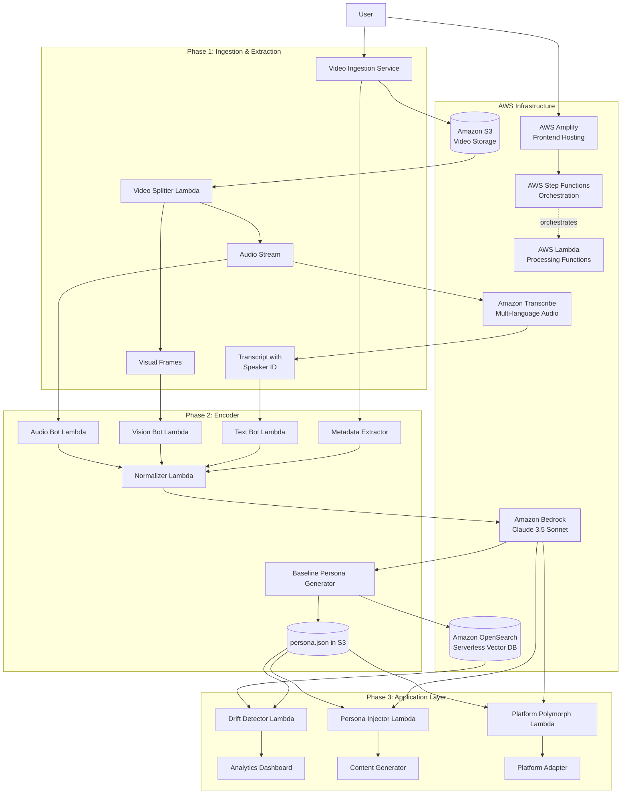

see our team worked on your suggestions here is the updated work 

# Design Document: Project Mirror - Digital Persona Schema System

## Overview

Project Mirror is an Identity Preservation Engine that mathematically defines and preserves a content creator's unique style. The system operates as a three-phase pipeline: (1) Ingestion & Extraction, (2) Encoding, and (3) Application Layer. It analyzes video content across four DNA pillars to create a baseline persona, then provides analytics, generative, and adaptation tools to help creators maintain their authentic voice at scale.

The architecture is designed for modularity, allowing each DNA analyzer to operate independently while contributing to a unified persona schema. The system prioritizes accuracy in pattern detection and provides actionable insights rather than generic metrics.

The system is built on AWS-native services using a serverless event-driven architecture for scalability and cost-efficiency. It leverages Amazon Bedrock for AI analysis, Amazon Transcribe for multi-language audio processing, Amazon S3 for storage, AWS Lambda and Step Functions for orchestration, and Amazon OpenSearch Serverless for vector-based persona tracking and drift detection.

## Architecture

### High-Level Architecture



### Component Architecture

The system follows a serverless microservices architecture with clear separation of concerns:

1. **Ingestion Layer**: Handles external API integration, video downloading, and S3 storage
2. **Extraction Layer**: Parallel Lambda-based processing of audio, visual, and text analysis
3. **Storage Layer**: S3 for video/persona storage, OpenSearch Serverless for vector-based persona tracking
4. **AI Layer**: Amazon Bedrock (Claude 3.5 Sonnet) for semantic analysis, content generation, and persona injection
5. **Orchestration Layer**: AWS Step Functions for coordinating the event-driven pipeline
6. **Application Layer**: Three distinct products sharing the same persona data
7. **Frontend Layer**: AWS Amplify for hosting and deployment
8. **API Gateway**: RESTful API with Lambda integration for all client interactions

### Technology Stack

**AI & Machine Learning**:
- **Amazon Bedrock**: Claude 3.5 Sonnet model for semantic analysis, content generation, and persona injection (200k token context window)
- **Amazon Bedrock**: Claude Haiku or Amazon Titan for cost-effective transcript summarization (reduces token costs)
- **Knowledge Bases for Amazon Bedrock**: RAG implementation for persona-aware content generation
- **Amazon Transcribe**: Multi-language (Hindi/English) audio transcription with speaker identification

**Compute & Orchestration**:
- **AWS Lambda**: Serverless functions for all processing components
- **AWS Lambda with Docker Container Images**: For heavy ML libraries (OpenCV, Librosa) stored in Amazon ECR (10GB vs 250MB limit)
- **AWS Step Functions**: Orchestration of the ingestion → transcribe → analyze → index pipeline
- **AWS Elemental MediaConvert**: Robust video processing for audio extraction and frame generation (avoids Lambda timeout issues)

**Storage & Database**:
- **Amazon S3**: Video storage, persona.json storage, and intermediate processing artifacts
- **Amazon OpenSearch Serverless**: Vector database for persona embeddings, drift tracking, and similarity search
- **Amazon ECR**: Docker container registry for Lambda container images

**Computer Vision & Audio**:
- **OpenCV**: Frame analysis and shot detection (running in Lambda Docker containers)
- **Librosa**: Acoustic analysis (running in Lambda Docker containers)
- **Amazon Rekognition**: Face detection and visual analysis (optional enhancement)

**Frontend & Deployment**:
- **AWS Amplify**: Frontend hosting and deployment
- **Amazon CloudFront**: CDN for global content delivery
- **Amazon API Gateway**: RESTful API endpoints with Lambda integration

**Security & Authentication**:
- **Amazon Cognito**: User authentication and authorization
- **AWS IAM**: Role-based access control for services

**Monitoring & Logging**:
- **Amazon CloudWatch**: Logging, monitoring, and alerting
- **AWS X-Ray**: Distributed tracing for debugging

### Architecture Optimizations

**1. Lambda Timeout Prevention**:
- **Problem**: Processing large videos (1GB+, 15+ minutes) in Lambda hits the 15-minute timeout and memory limits with FFMPEG.
- **Solution**: Use AWS Elemental MediaConvert for video processing. MediaConvert handles extraction of audio and frame generation at scale, saving results directly to S3. This is cheaper, faster, and bulletproof compared to Lambda-based FFMPEG.
- **Benefit**: Counts as another AWS service for innovation scoring, eliminates timeout issues entirely.

**2. Heavy Dependency Management**:
- **Problem**: OpenCV and Librosa libraries often exceed the 250MB Lambda Layer limit.
- **Solution**: Deploy Vision Bot and Audio Bot as Docker Container Images stored in Amazon ECR. This provides 10GB of space instead of 250MB.
- **Benefit**: Install all heavy ML libraries without size constraints, simplifies deployment.

**3. Token Cost Optimization**:
- **Problem**: Feeding raw 1-hour transcripts with detailed prompts into Claude 3.5 Sonnet burns through tokens and costs.
- **Solution**: Implement a Summarization Chain:
  - Step 1: Use cheaper model (Claude Haiku or Amazon Titan) to clean and summarize transcript chunks
  - Step 2: Feed structured summary into Claude 3.5 Sonnet for deep psychological analysis
- **Benefit**: Significantly reduces token costs while maintaining analysis quality.

**4. Bharat-Specific Metrics**:
- **Hinglish Tokenizer**: Measures code-mixing frequency (switches_per_minute) as an indicator of informality and relatability.
- **Jugaad Aesthetic**: Measures background_clutter in Vision Bot. High clutter + good audio quality = authentic high-potential creator.
- **Desi-Meter Enhancement**: Combines cultural markers, local references, and Hinglish frequency for comprehensive authenticity scoring.

### Indian Context-Specific Features

**"Desi-Meter"**: Fine-tuned prompts on Bedrock for Indian context relatability grading, measuring cultural authenticity and local connect rather than global quality metrics. Enhanced with:
- **Hinglish Tokenizer**: Detects code-mixing frequency (switches_per_minute). High switching indicates high informality/relatability in Indian content.
- **Cultural Markers**: Identifies local references, relatable examples, and vernacular usage patterns.
- **Authenticity Score**: Combines multiple signals to quantify "Desi" authenticity (0-1 scale).

**"Chaos Engine"**: Module to measure auditory and visual density (cuts per minute, sensory load) calibrated for Indian audience preferences where high retention correlates with high sensory load. Enhanced with:
- **Visual Density**: Measures cuts per minute, shot length, and frame complexity.
- **Auditory Density**: Measures speech rate, music presence, and silence gaps.
- **Combined Chaos Score**: Aggregates visual and auditory metrics for overall sensory load rating.

**"Jugaad Aesthetic"**: Measures background_clutter in Vision Bot to identify authentic Indian creator style:
- **Background Clutter Analysis**: In India, a "messy" background often correlates with "trustworthy/authentic" (the tech guy in his bedroom), whereas a polished studio can feel "fake."
- **Jugaad Score Calculation**: If chaos_score is high but audio_quality is good = High Potential Creator (good content, raw vibe).
- **Authenticity Indicator**: Helps identify creators with genuine, relatable content despite low production values.

**"Vernacular Translator"**: Extract persona and generate dubbed scripts in different Indian languages (Hindi, Tamil, Telugu, etc.) while preserving personality traits, jokes, and catchphrases using Bedrock's translation capabilities.

## Components and Interfaces

### 1. Video Ingestion Service

**Responsibility**: Download videos from content platforms and store them in S3 for processing.

**Interface**:
```
ingest_channel(channel_handle: string, video_count: int) -> IngestJob
  - Retrieves most recent videos from platform
  - Uploads videos to S3
  - Triggers Step Functions workflow
  - Returns job ID for tracking progress
  - Handles rate limiting and authentication

get_ingest_status(job_id: string) -> IngestStatus
  - Returns current status of ingestion job
  - Includes progress percentage and error details
```

**Key Behaviors**:
- Supports multiple platform APIs (YouTube, TikTok, etc.)
- Implements retry logic for failed downloads
- Respects platform rate limits
- Validates video accessibility before download
- Stores videos in S3 with organized bucket structure
- Emits CloudWatch metrics for monitoring

**AWS Integration**:
- Runs as Lambda function triggered by API Gateway
- Stores videos in S3 bucket with lifecycle policies
- Triggers Step Functions state machine for processing
- Uses CloudWatch for logging and monitoring

### 2. Video Splitter

**Responsibility**: Decompose video files into analyzable components using AWS Elemental MediaConvert for robust, scalable processing.

**Interface**:
```
split_video(s3_video_path: string) -> VideoComponents
  - Triggers AWS Elemental MediaConvert job for audio extraction and thumbnail generation
  - Extracts audio stream at optimal quality
  - Generates visual frames at 1fps for analysis
  - Triggers Amazon Transcribe for transcript generation
  - Returns S3 paths to all components

VideoComponents:
  - audio_s3_path: string
  - frames_s3_prefix: string
  - transcribe_job_id: string
  - mediaconvert_job_id: string
  - metadata: VideoMetadata
```

**Key Behaviors**:
- Uses AWS Elemental MediaConvert instead of FFMPEG in Lambda to avoid timeout and memory issues
- Handles large video files (1GB+, 15+ minutes) without Lambda limitations
- MediaConvert extracts audio and creates thumbnails at 1fps automatically
- Optimizes frame extraction rate based on video length
- Uses Amazon Transcribe for multi-language (Hindi/English) speech-to-text with speaker identification
- Preserves original video metadata
- Stores all artifacts in S3 with organized structure
- Cheaper and more reliable than Lambda-based FFMPEG processing

**AWS Integration**:
- Runs as Lambda function triggered by Step Functions
- Triggers AWS Elemental MediaConvert job for video processing
- MediaConvert saves audio and frames directly to S3
- Lambda monitors MediaConvert job completion via CloudWatch Events
- Starts Amazon Transcribe job after MediaConvert completes
- Supports Hindi/English multi-language transcription
- Uses CloudWatch for progress tracking and job monitoring

### 3. Vision Bot

**Responsibility**: Analyze visual frames to extract Visual DNA attributes using computer vision, deployed as Docker container for heavy ML libraries.

**Interface**:
```
analyze_visual(frames_s3_prefix: string) -> VisualDNA
  - Calculates cut_rate_per_min
  - Extracts color_palette
  - Classifies camera_angles
  - Measures face_presence
  - Calculates avg_shot_length_sec
  - Measures visual_density for "Chaos Engine"
  - Measures background_clutter for "Jugaad Aesthetic"

VisualDNA:
  - cut_rate_per_min: float
  - color_palette: ColorPalette
  - camera_angles: AngleDistribution
  - face_presence: float (0-1)
  - avg_shot_length_sec: float
  - visual_density: float (sensory load metric)
  - background_clutter: float (0-1, authenticity indicator)
  - jugaad_score: float (high clutter + good quality = authentic)
```

**Key Behaviors**:
- Detects shot boundaries using frame difference algorithms
- Uses color quantization for palette extraction
- Employs face detection models for presence calculation
- Classifies angles using pose estimation or heuristics
- Calculates visual density for Indian audience preferences
- Measures background_clutter: In India, a "messy" background often correlates with "trustworthy/authentic" (tech guy in bedroom), whereas polished studio can feel "fake"
- Calculates jugaad_score: If chaos_score is high but audio_quality is good = High Potential Creator (good content, raw vibe)

**AWS Integration**:
- Deployed as Docker Container Image in Lambda (stored in Amazon ECR) to handle heavy OpenCV libraries
- Docker deployment provides 10GB space vs 250MB Lambda Layer limit
- Reads frames from S3
- Optionally uses Amazon Rekognition for enhanced face detection
- Stores results in S3 and passes to normalizer

### 4. Audio Bot

**Responsibility**: Analyze audio streams to extract Audio DNA attributes using acoustic analysis, deployed as Docker container for heavy ML libraries.

**Interface**:
```
analyze_audio(audio_s3_path: string, transcript_s3_path: string) -> AudioDNA
  - Calculates avg_wpm
  - Measures pitch_variance
  - Classifies music_genre
  - Measures silence_gaps
  - Calculates auditory_density for "Chaos Engine"
  - Measures audio_quality for "Jugaad Aesthetic"

AudioDNA:
  - avg_wpm: float
  - pitch_variance: float
  - music_genre: string[]
  - silence_gaps: SilencePattern
  - auditory_density: float (sensory load metric)
  - audio_quality: float (0-1, production quality indicator)
```

**Key Behaviors**:
- Aligns Amazon Transcribe transcript with audio for WPM calculation
- Uses pitch tracking algorithms for variance measurement
- Employs music classification models for genre detection
- Identifies silence periods using amplitude thresholds
- Calculates auditory density for Indian audience preferences
- Measures audio_quality: Used in jugaad_score calculation (high visual chaos + good audio = authentic creator)

**AWS Integration**:
- Deployed as Docker Container Image in Lambda (stored in Amazon ECR) to handle heavy Librosa libraries
- Docker deployment provides 10GB space vs 250MB Lambda Layer limit
- Reads audio and transcript from S3
- Uses Amazon Transcribe output with speaker identification
- Stores results in S3 and passes to normalizer

### 5. Text Bot

**Responsibility**: Analyze transcripts to extract Semantic DNA attributes using Amazon Bedrock with optimized token usage via summarization chain.

**Interface**:
```
analyze_semantic(transcript_s3_path: string) -> SemanticDNA
  - Identifies catchphrases
  - Classifies hook_style
  - Extracts topic_clusters
  - Measures sentiment
  - Identifies narrative_structure
  - Calculates desi_meter (Indian context relatability)
  - Measures hinglish_tokenizer (code-mixing frequency)

SemanticDNA:
  - catchphrases: Phrase[]
  - hook_style: HookStyle
  - topic_clusters: TopicCluster[]
  - sentiment: Sentiment
  - narrative_structure: NarrativePattern
  - desi_meter: DesiMeter
  - hinglish_metrics: HinglishMetrics

DesiMeter:
  - score: float (0-1, cultural authenticity score)
  - cultural_markers: string[]
  - hinglish_frequency: float (code-mixing indicator)
  - local_references: int
  - relatable_examples: int

HinglishMetrics:
  - switches_per_minute: float (language switching frequency)
  - hindi_percentage: float (0-1)
  - english_percentage: float (0-1)
  - informality_score: float (high switching = high informality/relatability)
```

**Key Behaviors**:
- Uses n-gram frequency analysis for catchphrase detection
- Implements Summarization Chain to reduce token costs:
  - Step 1: Uses cheaper model (Claude Haiku or Titan) to clean and summarize transcript chunks
  - Step 2: Feeds structured summary into Claude 3.5 Sonnet for deep psychological analysis
- Employs Amazon Bedrock (Claude 3.5 Sonnet) for hook style classification
- Uses topic modeling with Bedrock for clustering
- Applies sentiment analysis using Bedrock
- Pattern matches common narrative structures
- Calculates "Desi-Meter" for Indian context relatability
- Detects "Hinglish Tokenizer": Measures code-mixing frequency (switches_per_minute)
- High switching indicates high informality/relatability in Indian content

**AWS Integration**:
- Runs as Lambda function
- Reads transcript from S3
- Calls Amazon Bedrock API with two-stage approach:
  - Claude Haiku/Titan for summarization (cost optimization)
  - Claude 3.5 Sonnet for deep analysis
- Uses fine-tuned prompts for Indian context analysis
- Stores results in S3 and passes to normalizer

### 6. Metadata Extractor

**Responsibility**: Extract behavioral attributes from video metadata.

**Interface**:
```
extract_behavioral(video_metadata: VideoMetadata[]) -> BehavioralDNA
  - Calculates call_to_action_freq
  - Identifies upload_schedule
  - Classifies community_tone

BehavioralDNA:
  - call_to_action_freq: float
  - upload_schedule: SchedulePattern
  - community_tone: ToneClassification
```

**Key Behaviors**:
- Analyzes video descriptions and end screens for CTAs
- Identifies temporal patterns in upload times
- Classifies tone from comments and community posts

### 7. Normalizer

**Responsibility**: Aggregate and normalize extracted DNA data, then store in OpenSearch.

**Interface**:
```
normalize(
  visual_dna: VisualDNA[],
  audio_dna: AudioDNA[],
  semantic_dna: SemanticDNA[],
  behavioral_dna: BehavioralDNA
) -> NormalizedPersona
  - Calculates statistical aggregates (mean, std dev)
  - Identifies top-performing video patterns
  - Normalizes scales across attributes
  - Generates persona embeddings for OpenSearch
```

**Key Behaviors**:
- Computes weighted averages based on video performance
- Handles missing data gracefully
- Normalizes numeric values to comparable scales
- Identifies outliers and filters them appropriately
- Generates vector embeddings for persona storage

**AWS Integration**:
- Runs as Lambda function
- Reads DNA data from S3
- Generates embeddings using Amazon Bedrock
- Stores normalized data in S3
- Indexes persona vectors in Amazon OpenSearch Serverless

### 8. Baseline Persona Generator

**Responsibility**: Create the canonical persona.json file and store in S3 and OpenSearch.

**Interface**:
```
generate_baseline(normalized: NormalizedPersona) -> PersonaSchema
  - Constructs persona.json structure
  - Validates against schema
  - Versions the persona
  - Stores in S3 and OpenSearch

PersonaSchema:
  - version: string
  - created_at: timestamp
  - author_persona: AuthorPersona
  - visual_dna: VisualDNA
  - audio_dna: AudioDNA
  - semantic_dna: SemanticDNA
  - behavioral_dna: BehavioralDNA
  - indian_context_metrics: IndianContextMetrics
```

**Key Behaviors**:
- Follows strict JSON schema validation
- Includes metadata for versioning and tracking
- Stores both aggregate and per-video data
- Generates human-readable summary
- Creates vector embeddings for similarity search

**AWS Integration**:
- Runs as Lambda function
- Stores persona.json in S3 with versioning enabled
- Indexes persona vectors in Amazon OpenSearch Serverless
- Uses S3 lifecycle policies for version management
- Emits CloudWatch metrics for monitoring

### 9. Drift Detector

**Responsibility**: Compare new content against baseline persona using OpenSearch vector similarity.

**Interface**:
```
detect_drift(
  new_video_s3_path: string,
  baseline_persona: PersonaSchema
) -> DriftReport
  - Analyzes new video
  - Compares against baseline using vector similarity
  - Calculates drift scores
  - Generates alerts
  - Queries OpenSearch for historical drift patterns

DriftReport:
  - overall_drift_score: float
  - visual_drift: DriftDetail
  - audio_drift: DriftDetail
  - semantic_drift: DriftDetail
  - behavioral_drift: DriftDetail
  - alerts: Alert[]
  - recommendations: string[]
  - historical_trend: DriftTrend[]
```

**Key Behaviors**:
- Reuses extraction pipeline for new video analysis
- Calculates per-attribute drift using distance metrics
- Uses OpenSearch vector similarity for semantic drift
- Applies thresholds for alert generation
- Correlates drift with performance when available
- Tracks drift trends over time using OpenSearch

**AWS Integration**:
- Runs as Lambda function
- Reads baseline persona from S3 and OpenSearch
- Triggers Step Functions for new video analysis
- Queries OpenSearch for historical drift patterns
- Stores drift reports in S3
- Emits CloudWatch alarms for high drift

### 10. Persona Injector

**Responsibility**: Rewrite content using creator's semantic DNA via Amazon Bedrock with RAG.

**Interface**:
```
inject_persona(
  generic_content: string,
  persona: PersonaSchema,
  content_type: ContentType
) -> GeneratedContent
  - Rewrites content using persona patterns
  - Uses RAG to recall specific past examples
  - Maintains semantic DNA attributes
  - Preserves core message

GeneratedContent:
  - rewritten_text: string
  - alignment_score: float
  - applied_patterns: string[]
  - recalled_examples: string[]
```

**Key Behaviors**:
- Constructs Bedrock prompts with persona attributes
- Uses Knowledge Bases for Amazon Bedrock for RAG
- Recalls specific past jokes, hooks, and catchphrases
- Validates output against semantic DNA
- Iteratively refines if alignment is low
- Preserves factual content while adjusting style

**AWS Integration**:
- Runs as Lambda function
- Calls Amazon Bedrock API with Claude 3.5 Sonnet
- Uses Knowledge Bases for Amazon Bedrock for RAG
- Queries OpenSearch for similar past content
- Stores generated content in S3
- Tracks generation quality metrics in CloudWatch

### 11. Platform Polymorph

**Responsibility**: Adapt content for different platforms while preserving identity using Bedrock.

**Interface**:
```
adapt_for_platform(
  source_content: VideoContent,
  persona: PersonaSchema,
  target_platform: Platform
) -> AdaptedContent
  - Applies platform-specific constraints
  - Preserves core identity attributes
  - Optimizes for platform algorithms
  - Generates vernacular translations if needed

AdaptedContent:
  - adapted_video: VideoContent
  - adaptation_report: AdaptationReport
  - preserved_attributes: string[]
  - vernacular_scripts: VernacularScript[] (optional)
```

**Key Behaviors**:
- Applies platform-specific rules (duration, aspect ratio, pacing)
- Maintains visual and audio DNA within constraints
- Adjusts behavioral DNA for platform norms
- Validates that core identity is preserved
- Generates vernacular translations using Bedrock

**AWS Integration**:
- Runs as Lambda function
- Calls Amazon Bedrock for content adaptation
- Uses Bedrock for vernacular translation (Hindi, Tamil, Telugu, etc.)
- Stores adapted content in S3
- Validates adaptation quality using drift detection

## Data Models

### PersonaSchema (persona.json)

```json
{
  "version": "1.0.0",
  "created_at": "2024-01-15T10:30:00Z",
  "updated_at": "2024-01-15T10:30:00Z",
  "channel_handle": "creator_name",
  "videos_analyzed": 50,
  "s3_bucket": "project-mirror-personas",
  "opensearch_index": "persona-vectors",
  
  "author_persona": {
    "demographics": {
      "primary_language": "en",
      "secondary_languages": ["hi", "ta"],
      "content_category": "tech_education"
    },
    "personality_traits": {
      "energy_level": 0.85,
      "formality": 0.3,
      "humor_frequency": 0.6
    }
  },
  
  "visual_dna": {
    "cut_rate_per_min": {
      "mean": 12.5,
      "std_dev": 2.3,
      "top_10_mean": 14.2
    },
    "color_palette": {
      "dominant_colors": ["#FF5733", "#3498DB", "#2ECC71"],
      "saturation_level": 0.75,
      "brightness_level": 0.65
    },
    "camera_angles": {
      "close_up": 0.45,
      "medium": 0.35,
      "wide": 0.20
    },
    "face_presence": {
      "mean": 0.78,
      "std_dev": 0.12
    },
    "avg_shot_length_sec": {
      "mean": 4.8,
      "std_dev": 1.2
    },
    "visual_density": {
      "mean": 0.82,
      "std_dev": 0.15,
      "comment": "High sensory load for Indian audience"
    },
    "background_clutter": {
      "mean": 0.65,
      "std_dev": 0.18,
      "comment": "Messy background = trustworthy/authentic in Indian context"
    },
    "jugaad_score": {
      "mean": 0.72,
      "std_dev": 0.14,
      "comment": "High chaos + good audio quality = High Potential Creator"
    }
  },
  
  "audio_dna": {
    "avg_wpm": {
      "mean": 165.0,
      "std_dev": 15.0
    },
    "pitch_variance": {
      "mean": 0.42,
      "std_dev": 0.08
    },
    "music_genre": ["electronic", "lo-fi", "bollywood"],
    "silence_gaps": {
      "avg_gap_duration_sec": 0.8,
      "gaps_per_minute": 3.2
    },
    "auditory_density": {
      "mean": 0.78,
      "std_dev": 0.12,
      "comment": "High auditory load for Indian audience"
    },
    "audio_quality": {
      "mean": 0.82,
      "std_dev": 0.09,
      "comment": "Production quality indicator for jugaad_score calculation"
    }
  },
  
  "semantic_dna": {
    "catchphrases": [
      {"phrase": "let's dive in", "frequency": 0.85},
      {"phrase": "here's the thing", "frequency": 0.62},
      {"phrase": "chaliye shuru karte hain", "frequency": 0.45, "language": "hi"}
    ],
    "hook_style": "rhetorical_question",
    "topic_clusters": [
      {"cluster": "productivity", "weight": 0.45},
      {"cluster": "technology", "weight": 0.35},
      {"cluster": "creativity", "weight": 0.20}
    ],
    "sentiment": {
      "valence": 0.72,
      "arousal": 0.68
    },
    "narrative_structure": "problem_solution",
    "desi_meter": {
      "score": 0.75,
      "cultural_markers": ["hinglish", "local_references", "relatable_examples"],
      "hinglish_frequency": 0.45,
      "local_references": 12,
      "relatable_examples": 8,
      "comment": "High Indian context relatability"
    },
    "hinglish_metrics": {
      "switches_per_minute": 8.5,
      "hindi_percentage": 0.35,
      "english_percentage": 0.65,
      "informality_score": 0.82,
      "comment": "High switching = high informality/relatability"
    }
  },
  
  "behavioral_dna": {
    "call_to_action_freq": 1.8,
    "upload_schedule": {
      "pattern": "weekly",
      "preferred_days": ["tuesday", "thursday"],
      "preferred_time": "14:00"
    },
    "community_tone": "friendly_casual"
  },
  
  "indian_context_metrics": {
    "chaos_score": 0.80,
    "vernacular_usage": 0.45,
    "cultural_authenticity": 0.75,
    "local_connect": 0.82,
    "jugaad_score": 0.72,
    "hinglish_switches_per_minute": 8.5,
    "background_clutter": 0.65,
    "audio_quality": 0.82,
    "comment": "High chaos + good audio = authentic high-potential creator"
  },
  
  "aws_metadata": {
    "bedrock_model": "anthropic.claude-3-5-sonnet-20241022-v2:0",
    "transcribe_language": "hi-IN,en-IN",
    "opensearch_vector_id": "persona_abc123",
    "s3_persona_path": "s3://project-mirror-personas/creator_name/persona.json",
    "last_drift_check": "2024-01-20T15:45:00Z"
  }
}
```

### DriftReport

```json
{
  "video_id": "abc123",
  "analyzed_at": "2024-01-20T15:45:00Z",
  "overall_drift_score": 0.23,
  "s3_report_path": "s3://project-mirror-reports/creator_name/drift_abc123.json",
  
  "visual_drift": {
    "drift_score": 0.31,
    "changes": [
      {
        "attribute": "cut_rate_per_min",
        "baseline": 12.5,
        "current": 9.2,
        "deviation": -0.26,
        "severity": "high"
      },
      {
        "attribute": "face_presence",
        "baseline": 0.78,
        "current": 0.65,
        "deviation": -0.17,
        "severity": "medium"
      }
    ]
  },
  
  "audio_drift": {
    "drift_score": 0.18,
    "changes": [
      {
        "attribute": "avg_wpm",
        "baseline": 165.0,
        "current": 152.0,
        "deviation": -0.08,
        "severity": "low"
      }
    ]
  },
  
  "semantic_drift": {
    "drift_score": 0.15,
    "vector_similarity": 0.85,
    "opensearch_query_time_ms": 45,
    "changes": [
      {
        "attribute": "hook_style",
        "baseline": "rhetorical_question",
        "current": "bold_claim",
        "severity": "medium"
      }
    ]
  },
  
  "behavioral_drift": {
    "drift_score": 0.05,
    "changes": []
  },
  
  "indian_context_drift": {
    "chaos_score_change": -0.15,
    "desi_meter_change": -0.10,
    "vernacular_usage_change": -0.05,
    "jugaad_score_change": -0.08,
    "hinglish_switches_change": -2.3,
    "background_clutter_change": -0.12,
    "comment": "Decreased authenticity signals - content becoming more polished/less relatable"
  },
  
  "alerts": [
    {
      "severity": "high",
      "message": "Your pacing has slowed by 26%, which correlates with a 20% drop in retention.",
      "recommendation": "Consider increasing cut rate to match your baseline of 12.5 cuts/min",
      "bedrock_generated": true
    }
  ],
  
  "performance_correlation": {
    "views": -0.18,
    "retention": -0.22,
    "engagement": -0.12
  },
  
  "historical_trend": [
    {
      "date": "2024-01-15",
      "drift_score": 0.12
    },
    {
      "date": "2024-01-18",
      "drift_score": 0.18
    },
    {
      "date": "2024-01-20",
      "drift_score": 0.23
    }
  ]
}
```

### VideoComponents

```json
{
  "video_id": "abc123",
  "original_s3_path": "s3://project-mirror-videos/creator_name/abc123.mp4",
  "audio_s3_path": "s3://project-mirror-processed/creator_name/abc123/audio.wav",
  "frames_s3_prefix": "s3://project-mirror-processed/creator_name/abc123/frames/",
  "transcript_s3_path": "s3://project-mirror-processed/creator_name/abc123/transcript.json",
  "transcribe_job_id": "transcribe-job-abc123",
  "metadata": {
    "duration_sec": 620,
    "resolution": "1920x1080",
    "fps": 30,
    "upload_date": "2024-01-15",
    "title": "How to Build Better Habits",
    "views": 125000,
    "likes": 8500,
    "comments": 342,
    "language_detected": ["hi-IN", "en-IN"],
    "speaker_count": 1
  }
}
```

### IngestJob

```json
{
  "job_id": "job_xyz789",
  "channel_handle": "creator_name",
  "status": "in_progress",
  "progress": 0.65,
  "videos_requested": 50,
  "videos_completed": 32,
  "videos_failed": 1,
  "started_at": "2024-01-15T10:00:00Z",
  "estimated_completion": "2024-01-15T11:30:00Z",
  "step_function_execution_arn": "arn:aws:states:us-east-1:123456789012:execution:project-mirror-pipeline:job_xyz789",
  "s3_output_bucket": "project-mirror-processed",
  "errors": [
    {
      "video_id": "def456",
      "error": "Video is private or unavailable",
      "cloudwatch_log_group": "/aws/lambda/project-mirror-ingestion",
      "cloudwatch_log_stream": "2024/01/15/[$LATEST]abc123"
    }
  ]
}
```


## Correctness Properties

*A property is a characteristic or behavior that should hold true across all valid executions of a system—essentially, a formal statement about what the system should do. Properties serve as the bridge between human-readable specifications and machine-verifiable correctness guarantees.*

### Property 1: Video Retrieval Completeness
*For any* valid channel handle, when requesting video retrieval, the system should return either the requested number of videos or all available videos if fewer exist, and the count should never exceed the channel's total video count.
**Validates: Requirements 1.1, 1.4**

### Property 2: Video Component Separation
*For any* video file, after splitting, the system should produce exactly three components (audio, visual frames, transcript), and each component should be non-empty and accessible.
**Validates: Requirements 1.2**

### Property 3: Error Message Descriptiveness
*For any* failed operation, the system should return an error message that contains specific information about the failure type and affected resource.
**Validates: Requirements 1.3, 15.1, 15.2**

### Property 4: Format Support Universality
*For any* video file in a supported format (regardless of duration), the video splitter should successfully process it without format-related errors.
**Validates: Requirements 1.5**

### Property 5: Vision Bot Output Completeness
*For any* set of visual frames, the Vision Bot should produce all five required metrics (cut_rate_per_min, color_palette, camera_angles, face_presence, avg_shot_length_sec), and each metric should be within valid ranges.
**Validates: Requirements 2.1, 2.2, 2.3, 2.4, 2.5**

### Property 6: Audio Bot Output Completeness
*For any* audio file with transcript, the Audio Bot should produce all four required metrics (avg_wpm, pitch_variance, music_genre, silence_gaps), and each metric should be within valid ranges.
**Validates: Requirements 3.1, 3.2, 3.3, 3.4**

### Property 7: Text Bot Output Completeness
*For any* transcript, the Text Bot should produce all five required attributes (catchphrases, hook_style, topic_clusters, sentiment, narrative_structure), and each attribute should conform to its expected type.
**Validates: Requirements 4.1, 4.2, 4.3, 4.4, 4.5**

### Property 8: Behavioral Metrics Extraction
*For any* set of video metadata, the system should produce all three behavioral metrics (call_to_action_freq, upload_schedule, community_tone), and each metric should be within valid ranges.
**Validates: Requirements 5.1, 5.2, 5.3**

### Property 9: Analyzer Structured Output
*For any* analyzer output (Vision Bot, Audio Bot, Text Bot, or Behavioral extractor), the output should be valid structured data that can be parsed and contains all required fields for that analyzer type.
**Validates: Requirements 2.6, 3.5, 4.6, 5.4**

### Property 10: DNA Normalization Completeness
*For any* complete set of extracted DNA data across all four pillars, the normalizer should produce aggregated statistics (mean, std_dev) for all numeric attributes and consolidated lists for categorical attributes.
**Validates: Requirements 6.1**

### Property 11: Top Performer Baseline Calculation
*For any* set of videos with performance metrics, when calculating the baseline, the system should identify the top 10 performers (or all videos if fewer than 10), and the baseline should be the average of only those top performers.
**Validates: Requirements 6.2**

### Property 12: Persona Generation Completeness
*For any* normalized DNA data, the encoder should generate a persona.json file that contains all four DNA pillars with their respective attributes.
**Validates: Requirements 6.3**

### Property 13: Persona Schema Round-Trip
*For any* generated persona.json file, parsing it as JSON should succeed, and the parsed object should conform to the PersonaSchema structure with all required fields present and valid.
**Validates: Requirements 6.4, 11.2**

### Property 14: Drift Score Calculation
*For any* new video analysis and baseline persona, the drift detector should calculate a drift score for each of the four DNA pillars, and each score should be a non-negative number.
**Validates: Requirements 7.1, 7.2**

### Property 15: Drift Alert Generation
*For any* drift analysis where at least one pillar's drift score exceeds the threshold, the system should generate at least one alert, and each alert should identify specific changed attributes.
**Validates: Requirements 7.3, 7.4**

### Property 16: Drift Trend Calculation
*For any* sequence of video analyses, the system should calculate rolling averages for drift scores, and the rolling average at position N should only consider videos up to position N.
**Validates: Requirements 7.5**

### Property 17: Performance Correlation
*For any* drift analysis with available performance metrics, the system should calculate correlation coefficients between drift scores and performance metrics, and correlations should be in the range [-1, 1].
**Validates: Requirements 7.6, 12.2**

### Property 18: Semantic DNA Preservation in Rewrites
*For any* rewritten content using a persona, the output should incorporate elements from the persona's semantic DNA (catchphrases should appear, hook style should match, sentiment should align within tolerance, and narrative structure should be preserved).
**Validates: Requirements 8.1, 8.2, 8.3, 8.4, 8.5**

### Property 19: Platform Constraint Application
*For any* content adapted for a target platform, the adapted content should satisfy all platform-specific constraints (duration limits, aspect ratio, pacing requirements) for that platform.
**Validates: Requirements 9.1, 9.2**

### Property 20: Identity Preservation in Adaptation
*For any* adapted content, when analyzing the adapted content's DNA and comparing it to the original persona, the drift score should remain within acceptable thresholds (indicating core identity is preserved).
**Validates: Requirements 9.3, 9.4, 9.5**

### Property 21: Agency Dashboard Completeness
*For any* agency user with managed creators, the dashboard should display all creators, and each creator entry should include their current drift score.
**Validates: Requirements 10.1, 10.2**

### Property 22: High Drift Highlighting
*For any* set of creators displayed in the dashboard, all creators with drift scores exceeding the threshold should be visually highlighted, and no creators below the threshold should be highlighted.
**Validates: Requirements 10.3**

### Property 23: Creator List Operations
*For any* list of creators, filtering by drift score should return only creators matching the filter criteria, and sorting by drift score should produce a list ordered by that score.
**Validates: Requirements 10.4**

### Property 24: Aggregate Analytics Calculation
*For any* set of managed creators, aggregate analytics should include statistics computed across all creators (mean drift, median drift, distribution), and these statistics should be mathematically correct.
**Validates: Requirements 10.5**

### Property 25: Persona Storage Round-Trip
*For any* baseline persona, after storing it as persona.json and then retrieving it, the retrieved persona should be equivalent to the original persona (all attributes match).
**Validates: Requirements 11.1, 11.3**

### Property 26: Persona Versioning
*For any* persona update, the new version should have a version number greater than the previous version, and both versions should be retrievable independently.
**Validates: Requirements 11.4**

### Property 27: Graceful File Handling
*For any* attempt to retrieve a missing or corrupted persona.json file, the system should return an error (not crash) and the error should indicate whether the file is missing or corrupted.
**Validates: Requirements 11.5**

### Property 28: Performance Metrics Retrieval
*For any* drift analysis request, if performance metrics exist for the analyzed videos, those metrics should be retrieved and included in the analysis output.
**Validates: Requirements 12.1**

### Property 29: Correlation Highlighting
*For any* correlation analysis, if the correlation coefficient exceeds the significance threshold (e.g., |r| > 0.3), the correlation should be marked as significant in the output.
**Validates: Requirements 12.3**

### Property 30: Attribute-Performance Correlation
*For any* performance drop (defined as performance below baseline), the system should identify which specific attributes changed in the same direction as the performance drop.
**Validates: Requirements 12.4**

### Property 31: Correlation-Based Recommendations
*For any* correlation analysis with significant correlations, the system should generate at least one recommendation based on the identified correlations.
**Validates: Requirements 12.5**

### Property 32: Schema Comparison Completeness
*For any* two persona schemas, the comparison should calculate differences for all four DNA pillars, and each difference should be quantified numerically.
**Validates: Requirements 13.1, 13.2**

### Property 33: Deviation Highlighting
*For any* schema comparison, the output should identify and highlight the attributes with the largest deviations (top N differences), and these should be sorted by deviation magnitude.
**Validates: Requirements 13.3**

### Property 34: Comparison Recommendations
*For any* schema comparison, the system should generate specific recommendations for each major deviation, and each recommendation should reference a specific attribute to adjust.
**Validates: Requirements 13.4**

### Property 35: Schema Visualization
*For any* two schemas being compared, the system should generate visualization data that includes both schemas' attributes in a comparable format.
**Validates: Requirements 13.5**

### Property 36: Authentication Requirement
*For any* attempt to access system resources, if the request lacks valid authentication credentials, the system should deny access and require authentication.
**Validates: Requirements 14.1**

### Property 37: Credential Verification
*For any* authentication attempt, the system should verify the provided credentials against stored credentials, and access should be granted only if they match.
**Validates: Requirements 14.2**

### Property 38: Authentication Failure Handling
*For any* failed authentication attempt, the system should return an authentication error and deny access to the requested resource.
**Validates: Requirements 14.3**

### Property 39: Role-Based Access Control
*For any* authenticated user, the system should enforce role-based permissions, and users should only be able to perform actions allowed for their role (Creator or Agency).
**Validates: Requirements 14.4**

### Property 40: Persona Authorization
*For any* attempt to access a specific persona, the system should verify that the authenticated user has authorization for that persona, and deny access if they don't.
**Validates: Requirements 14.5**

### Property 41: Input Validation
*For any* input data provided to the system, validation should occur before processing, and invalid data should be rejected with specific error messages.
**Validates: Requirements 15.4, 15.5**

### Property 42: Processing Failure Logging
*For any* video processing failure, the system should create a log entry with error details and send a notification to the user who initiated the processing.
**Validates: Requirements 15.2**

### Property 43: Rate Limit Handling
*For any* API request that would exceed rate limits, the system should queue the request instead of failing, and notify the user that their request has been queued.
**Validates: Requirements 15.3**

## Error Handling

### Error Categories

1. **Input Validation Errors**
   - Invalid channel handles
   - Malformed video files
   - Invalid persona schemas
   - Out-of-range parameters

2. **External Service Errors**
   - Platform API failures
   - Rate limit exceeded
   - Network timeouts
   - Authentication failures with external services

3. **AWS Service Errors**
   - Lambda timeout or memory errors
   - S3 access denied or bucket not found
   - Transcribe job failures
   - Bedrock throttling or quota exceeded
   - OpenSearch indexing failures
   - Step Functions execution failures

4. **Processing Errors**
   - Video splitting failures
   - Analyzer crashes
   - Insufficient data for baseline
   - Corrupted intermediate files

5. **Storage Errors**
   - S3 storage errors
   - Disk space exhausted (Lambda /tmp)
   - Permission denied
   - Corrupted persona files

6. **Authorization Errors**
   - Unauthenticated access attempts
   - Insufficient IAM permissions
   - Expired Cognito tokens
   - Invalid credentials

### Error Handling Strategies

**Validation Errors**: Return immediately with descriptive error messages specifying which fields are invalid and why. Use HTTP 400 status codes. Log to CloudWatch for monitoring.

**External Service Errors**: Implement exponential backoff retry logic for transient failures. For rate limits, queue requests using SQS and notify users. Use circuit breaker pattern to prevent cascading failures. Monitor with CloudWatch alarms.

**AWS Service Errors**: 
- Lambda: Configure appropriate timeout and memory settings, use CloudWatch Logs for debugging
- S3: Implement retry logic with exponential backoff, use S3 event notifications for processing
- Transcribe: Monitor job status, implement retry for transient failures
- Bedrock: Handle throttling with exponential backoff, implement request queuing
- OpenSearch: Implement bulk indexing with error handling, monitor cluster health
- Step Functions: Use error handling states, implement retry and catch logic

**Processing Errors**: Log detailed error information to CloudWatch including stack traces. Notify users with user-friendly messages via SNS. Preserve partial results in S3 when possible. Use HTTP 500 status codes. Emit CloudWatch metrics for monitoring.

**Storage Errors**: Implement atomic write operations using S3 versioning. Maintain backups of critical files like persona.json using S3 lifecycle policies. Provide recovery mechanisms for corrupted files. Use S3 event notifications for monitoring.

**Authorization Errors**: Return generic error messages to prevent information leakage. Log detailed information to CloudWatch for security auditing. Use HTTP 401/403 status codes. Integrate with AWS Cognito for authentication.

### Error Recovery

- **Graceful Degradation**: If one analyzer Lambda fails, continue with others and mark the failed component
- **Partial Results**: Return partial persona schemas when some DNA pillars are unavailable, store in S3
- **Retry Mechanisms**: Automatic retry for transient failures with exponential backoff using Step Functions
- **User Notification**: Clear communication via SNS about what failed and what actions users can take
- **Fallback Values**: Use reasonable defaults when optional data is unavailable
- **Dead Letter Queues**: Use SQS DLQ for failed Lambda invocations to enable manual recovery
- **CloudWatch Alarms**: Set up alarms for critical failures (high error rate, Bedrock throttling, OpenSearch failures)

## Testing Strategy

### Dual Testing Approach

The system requires both unit testing and property-based testing for comprehensive coverage:

**Unit Tests** focus on:
- Specific examples demonstrating correct behavior
- Edge cases (empty inputs, boundary values, single-item collections)
- Error conditions and exception handling
- Integration points between components
- Mock external service interactions

**Property-Based Tests** focus on:
- Universal properties that hold for all inputs
- Comprehensive input coverage through randomization
- Invariants that must be preserved
- Round-trip properties (serialization/deserialization)
- Metamorphic properties (relationships between operations)

### Property-Based Testing Configuration

**Testing Library**: Use a property-based testing library appropriate for the implementation language:
- Python: Hypothesis
- JavaScript/TypeScript: fast-check
- Java: jqwik
- Other languages: appropriate PBT library

**Test Configuration**:
- Minimum 100 iterations per property test (due to randomization)
- Each property test must include a comment tag referencing the design property
- Tag format: `# Feature: project-mirror, Property {number}: {property_text}`

**Example Property Test Structure**:
```python
# Feature: project-mirror, Property 13: Persona Schema Round-Trip
@given(persona_schema=persona_generator())
def test_persona_round_trip(persona_schema):
    # Serialize to JSON
    json_str = json.dumps(persona_schema)
    
    # Deserialize back
    parsed = json.loads(json_str)
    
    # Verify equivalence
    assert parsed == persona_schema
    assert validate_persona_schema(parsed)
```

### Testing Coverage by Component

**Video Ingestion Service**:
- Unit: Test specific channel handles, mock API responses, mock S3 uploads
- Property: For any valid channel handle, retrieval should succeed or fail gracefully
- Integration: Test S3 upload and Step Functions trigger

**Video Splitter**:
- Unit: Test specific video formats, edge cases (very short/long videos), mock S3 operations
- Property: For any video file, splitting should produce three components
- Integration: Test S3 read/write and Transcribe job creation

**Vision Bot**:
- Unit: Test specific frame sequences, edge cases (single frame, no faces), mock S3 reads
- Property: For any frame sequence, all five metrics should be calculated
- Integration: Test Lambda execution with S3 event triggers

**Audio Bot**:
- Unit: Test specific audio samples, edge cases (silence, no speech), mock S3 and Transcribe
- Property: For any audio file, all four metrics should be calculated
- Integration: Test Transcribe output parsing and S3 storage

**Text Bot**:
- Unit: Test specific transcripts, edge cases (very short text, no punctuation), mock Bedrock API
- Property: For any transcript, all five attributes should be extracted
- Integration: Test Bedrock API calls with Claude 3.5 Sonnet model

**Encoder**:
- Unit: Test specific DNA combinations, edge cases (minimal data), mock OpenSearch
- Property: For any complete DNA data, persona.json should be valid
- Integration: Test S3 storage and OpenSearch indexing

**Drift Detector**:
- Unit: Test specific drift scenarios, edge cases (identical videos, completely different), mock OpenSearch queries
- Property: For any video and baseline, drift scores should be calculable
- Integration: Test OpenSearch vector similarity queries

**Persona Injector**:
- Unit: Test specific rewrite scenarios, edge cases (very short content), mock Bedrock and Knowledge Bases
- Property: For any content and persona, semantic DNA should be preserved
- Integration: Test Bedrock RAG with Knowledge Bases

**Platform Polymorph**:
- Unit: Test specific platform adaptations, edge cases (content already meeting constraints), mock Bedrock
- Property: For any adaptation, platform constraints should be satisfied
- Integration: Test Bedrock translation and adaptation

### Integration Testing

- Test complete pipeline from video ingestion through persona generation using Step Functions
- Test drift detection with real video sequences and OpenSearch queries
- Test multi-user scenarios for agency dashboard with Cognito authentication
- Test authentication and authorization flows with AWS Cognito and IAM
- Test error propagation through the Step Functions pipeline
- Test S3 event-driven triggers for Lambda functions
- Test Bedrock API integration with proper error handling
- Test OpenSearch indexing and querying with vector embeddings

### AWS-Specific Testing

**Lambda Testing**:
- Test cold start performance and optimization
- Test memory and timeout configurations
- Test concurrent execution limits
- Test error handling and retry logic

**S3 Testing**:
- Test bucket policies and access controls
- Test versioning and lifecycle policies
- Test event notifications and triggers
- Test cross-region replication if needed

**Step Functions Testing**:
- Test state machine transitions
- Test error handling and retry logic
- Test parallel execution branches
- Test timeout and catch states

**Bedrock Testing**:
- Test API throttling and quota limits
- Test prompt engineering for Indian context
- Test Knowledge Bases RAG functionality
- Test model response quality and consistency

**OpenSearch Testing**:
- Test vector indexing and similarity search
- Test query performance and optimization
- Test cluster scaling and health monitoring
- Test backup and restore procedures

**Cognito Testing**:
- Test user authentication flows
- Test token refresh and expiration
- Test role-based access control
- Test multi-factor authentication if enabled

### Performance Testing

- Measure processing time for videos of varying lengths in Lambda
- Test system behavior under concurrent user load with API Gateway
- Verify Lambda memory usage stays within bounds for large video sets
- Test API response times under load with CloudWatch metrics
- Test Step Functions execution time and cost optimization
- Test Bedrock API latency and throughput
- Test OpenSearch query performance with large datasets

### Security Testing

- Test authentication bypass attempts with Cognito
- Test authorization boundary violations with IAM policies
- Test input injection attacks (SQL, command injection)
- Test rate limiting effectiveness with API Gateway
- Test data isolation between users in S3 and OpenSearch
- Test encryption at rest (S3, OpenSearch) and in transit (TLS)
- Test IAM role permissions and least privilege principle
- Test CloudTrail logging for audit trails


what do you say